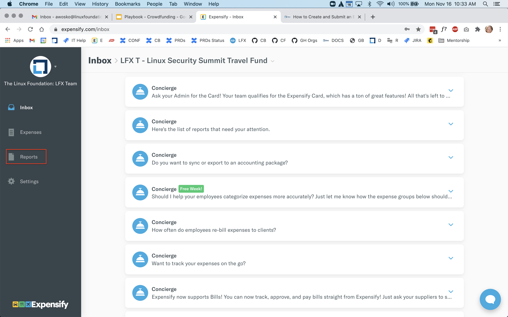

# How to Create and Submit an Expensify Report

Consolidate all of the expenses eligible for reimbursement to apply them to the report.

 1. Sign in to [https://www.expensify.com/signin](https://www.expensify.com/signin).

**Note:** Ensure that you select the correct fund policy that is associated with the project or event you are approved for.

2. Under your account, select **Reports** tab.

3. On **Reports** page, select **New Report** located in the top-right corner of your screen.

4. Write a **Report Name** that must include your name, and: 

a\) For events and travel funds: the name and year of the event, for example:`Jane Brown - Open Source Summit + Embedded Linux Conference North America 2020`

b\) For projects: the name of the project 

5. Click to add expenses to report.

6. On Add Expense To Report window, click **New Expense**.

7. Click  on **New Expense** window to add receipt, and provide receipt details.  
**Merchant:** Name of the Merchant.  
**Date:** Date of Purchase  
**Total:** Total amount in USD$  
**Category:** 

a\) For Events and Travel Funds, choose a category—Accommodation, Airfare, Ground Transportation, Other.

b\) For Projects, choose category applicable to your expense.


**Important:** For International \(non-U.S.\) reimbursements, upload a completed _The Linux Foundation Wire Transfer Form_ **in addition** to your receipt\(s\).




8. Click **Save** and repeat Step 6 to add more receipts.

9. After you add the expenses that are eligible for reimbursement, click **Submit** located in the top left corner of the **Reports** tab.

 

