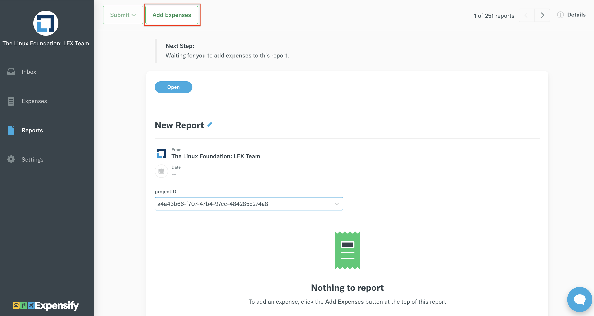

# How to Create and Submit an Expensify Report

Consolidate all of the expenses eligible for reimbursement to apply them to the report.

 1. Log in to[ Expensify](https://www.expensify.com/signin)  

**Note:** Ensure that you select the correct fund policy that is associated with the project or event you are approved for.

2. Under your account, select **Reports** tab.

3. On **Reports** page, select **New Report** located in the top-right corner of your screen.

  
4. A report name with a report ID is auto-generated.  Update the report name as follows: 

a\) For events and travel funds: enter the name and year of the event, for example: `Jane Brown - Open Source Summit + Embedded Linux Conference North America 2020`        b\) For projects: the name of the project 

5. Select **Add Expenses** to add expenses to report.   

6. On the **New Expense** screen upload your receipt and provide the following details:  
**Merchant:** Name of the Merchant.  
**Date:** Date of Purchase  
**Total:** Total amount in USD$  
**Category:**   
For Events and Travel Funds, choose a category—Accommodation, Airfare, Ground Transportation, Other.‌ For Projects, choose category applicable to your expense.

7. Click **Save** and repeat Step 6 to add additional expenses.


**Important:** For International \(non-U.S.\) reimbursements, upload a completed _The Linux Foundation Wire Transfer Form_ **in addition** to your receipt\(s\).




8. After you add all the expenses that are eligible for reimbursement, click **Submit** located in the top left corner of the **Reports** tab.

 

