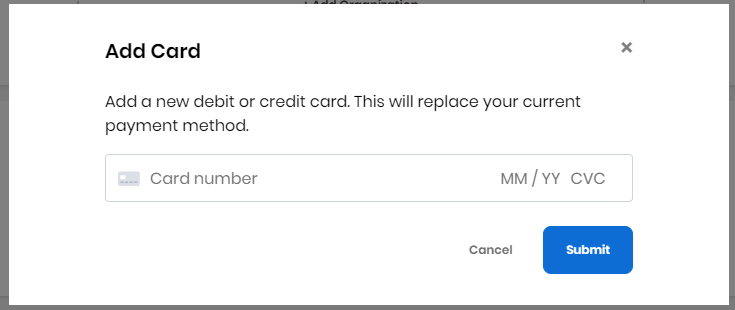

# Manage Your Crowdfunding Account

You can manage your Crowdfunding account, for example view a record of all your transactions or modify your monthly donations, add organization, add payment method, and so on.

1. [Sign in](../sso/sign-in/) to [Crowdfunding](https://crowdfunding.lfx.linuxfoundation.org/), and select a tab:

* [My Transactions](manage-your-crowdfunding-account.md#my-transactions)
* [My Projects](manage-your-crowdfunding-account.md#my-projects)
* [My Account](manage-your-crowdfunding-account.md#my-account)

### My Transactions

My Transactions shows your monthly donations and lists all your transactions with details.

* Click **Cancel Monthly Subscription** on a project to cancel your donation subscription. Click **Yes, cancel subscription** on the confirmation dialog that appears.
* Click **Discover projects** to go to the Projects page. This option appears when you do not have any Monthly Donations.

### My Projects

My Projects lets you see all the projects, security audits, initiatives, events, and funds that you maintain all in one place. You can see the status of a project, for example "Pending approval".

Click a project to see the fund details.Click **Edit** on a card to edit the fund details.

**Note: Mentorship Goal** is displayed under **Fund Distribution** if your project is enrolled in the Mentorship program. 

### **My Account**

**My Account** lets you manage your organization, and payment method.

**Manage Organization** lets you add or edit your organization. Click **+ Add Organization** to add an organization.

**Payment Method** lets you add or change your credit or debit card provider and number.

Click **Add Card** to add your card details.

Click **Edit Card** or **Delete Card** to edit or delete an existing payment method, respectively.

