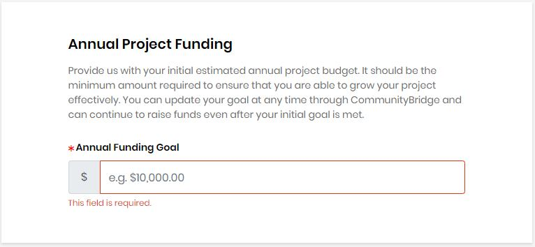
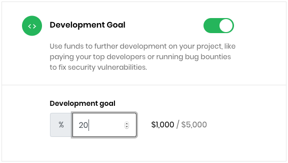
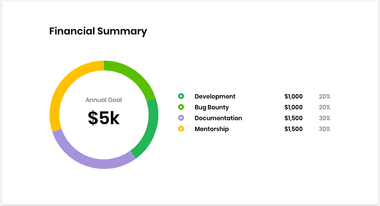

# Project Application

### Project Details

The following table lists all the fields in the **Project Details** panel of the Project Application:

| Field Name | Description |
| :--- | :--- |
| **Project Name** | A funding project name which must be unique. **Note:** Funds of a different type can use the same name. For example, a Travel Fund and a Project fund can use the same name. |
| **Topic / Category**  | Type of industry that relates to your repository. Click in the field to open a list of names to choose from. Click  after you select a category from the list. |
| **Elevator pitch**  | Brief statement of why your project is important to support. |
| **Repository URL** | URL of the Git repository.  **Note:** If you choose **Add GITHUB/GIT Repository** from the options while applying, your Git repository is automatically reflected in this field. |
| **Website URL** | A link to the website that you want to associate with the fund. |
| **CII Project ID** | The [Core Infrastructure Initiative \(CII\) Badge Program](https://www.coreinfrastructure.org/programs/badge-program/) is an open source secure development maturity model. Project admins need to apply to get a badge and CII Project ID number if their project doesn't have one.  |
| **Code of Conduct URL** | URL for the open source project code of conduct. If a project doesn't have a code of conduct, a program admin can create one by using a provided template. If not code of conduct is provided, the URL will default to [Contributor Covenant](https://www.contributor-covenant.org/version/1/4/code-of-conduct) code of conduct.  |

### Project Branding

The following table lists all the fields in the **Project Branding** panel of the Project Application:

| Filed Name | Description |
| :--- | :--- |
| **Project Logo** | A symbol or other design adopted by your organization that identifies your project. Click **Browse** to upload a file. File size should be 2MB max and in JPG, PNG, or SVG format. |
| **Accent Color** | A color that's a part of the project's brand.  Enter a **hexadecimal number** or click in the field to open the color picker. |

### Project Beneficiaries


**Important:** If you enroll your project for mentorship program, the accepted mentees are automatically added as project beneficiaries in the funding application. For details, see [enroll your project](../mentorship/administrators/enroll-your-program/).


Beneficiaries are individuals who work on a project and then request reimbursement for their time and expenses. They receive invitation from Expensify \(an expense management application\) to submit  [reimbursement](get-reimbursed.md) for their expenses.

The following table lists all the fields in the **Project Beneficiaries** panel of the Project Application:

| Field Name | Description |
| :--- | :--- |
| **Name** | The name of the person who you want to designate as a beneficiary of funds. |
| **Email** | The email of the project beneficiary. |

After you enter the name and email address of a person, click **+Add beneficiary** to add the person to the list. To add more beneficiaries, click **+ Add beneficiary** and complete the fields that appear.


**Note:** Only the project administrator can add or remove beneficiaries. The finance team is notified and adjusts the Expensify accounts accordingly.


### Annual Project Funding

**Annual Project Funding** is a total project funding goal amount for the year. The Annual Funding Goal amount is the sum of the individual goal amounts.

### Fund Distribution

**Fund Distribution** enables goals for how you want to distribute funds in your project. Enter a percentage of your Annual Funding Goal amount to designate towards the selected goal. Following are various goals towards which you can distribute your fund:

* **Development Goal:** You can use funds allocated for this category to pay top developers for contributing codes, adding features, fixing bugs, and training and bringing in new talents to the community.
* **Marketing Goal:** You can use funds allocated for this category to promote and grow your project through the development of collateral, website design, t-shirts to wear at events, and so on.
* **Meetups Goal:** You can use funds allocated for this category to socially connect with your community through local meetups, annual summits, or big industry events. ****
* **Bug Bounty Goal:** You can use funds allocated for this category to run bug bounty programs \(for example, through HackerOne or other program\), and pay community to help you identify bugs.
* **Travel Goal:** You can use funds allocated for this category to sponsor travel for project members to attend conferences, meetups, or customer meetings.
* **Documentation Goal:** You can use funds allocated for this category to drive specific documentation initiatives, such as paying technical writers, purchasing subscription premiums, and so on.

### Financial Summary

The Financial Summary shows the annual financial goal and progress towards it by individual goal. It shows a distribution report based on your selection from the **Fund Distribution** panel.

### Terms and Conditions

Read and agree to the Terms and Conditions, and **Submit** the application.


After The Linux Foundation reviews the application, you will receive an email notification with a review decision. 


