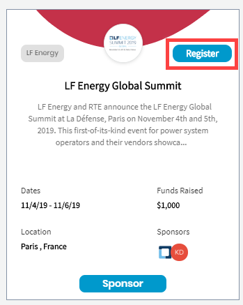

# Register for an Event

You can participate in an event to understand more about the project related information, and can socially involve with the entire community of the project.

**To Register for an event:** 

1. [Sign in](../sso/sign-in/) to [Crowdfunding](https://crowdfunding.lfx.linuxfoundation.org/).
2. Under **Events** tab, select an event that you want to participate, and click **Register**.

The event page opens. Click **REGISTER NOW** on the event page, and follow the procedure to register.  
  

