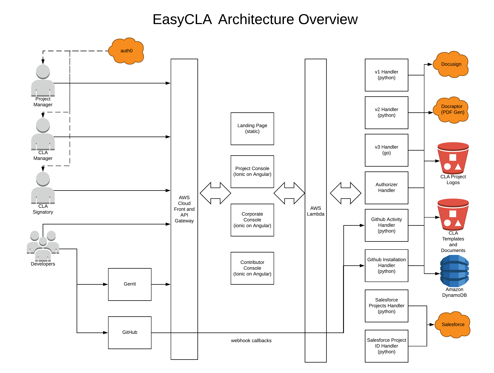

# EasyCLA

​[​](https://circleci.com/gh/communitybridge/easycla)EasyCLA streamlines the management and execution of Contributor License Agreements \(CLAs\) so you can stay compliant with project policies. It is the only tool to support both individual and corporate CLA workflows.

## Third-party Services 

​Besides integration with Auth0 and Salesforce, the CLA system uses the following third party services:

* ​[Docusign](https://www.docusign.com/) for the CLA agreement e-sign flow
* ​[Docraptor](https://docraptor.com/) for converting html CLA template to PDF file

## EasyCLA Backend 

The EasyCLA tool has two backend components.

The majority of the backend APIs are implemented in python, and can be found in the [`cla-backend`](https://github.com/communitybridge/easycla/tree/master/cla-backend) directory.

Recent backend development was implemented in Golang, and can be found in the [`cla-backend-go`](https://github.com/communitybridge/easycla/tree/master/cla-backend-go) directory. In particular, this backend contains APIs powering Automated Templates, GitHub Approved List of contributors, and Duplicate Company handling in the Corporate Console.

## EasyCLA Frontend 

EasyCLA frontend consists of three independent Single Page Application \(SPA\) built with [Ionic](https://ionicframework.com/) framework:

* [LFX Project Control Center](https://projectadmin.lfx.linuxfoundation.org/) for The Linux Foundation director/ project administrator to manage project's CLA. It is also referred to EasyCLA project console in the document.
* [Corporate CLA Console](https://organization.lfx.linuxfoundation.org/company/dashboard) for company CLA manager to sign a corporate CLA and manage employees using CLA approved list. It is also referred to EasyCLA corporate console in the document.
* [EasyCLA contributor console](https://github.com/communitybridge/easycla-contributor-console) for any project contributor to sign ICLA or CCLA.

## EasyCLA Architecture 

The following diagram explains the EasyCLA architecture:

## EasyCLA Release Process 

The following diagram illustrates the EasyCLA release process:

## License 

This project’s source code is licensed under the MIT License. A copy of the license is available in [LICENSE](https://github.com/communitybridge/easycla/blob/main/LICENSE).

The project includes source code from `keycloak`, which is licensed under the Apache License, version 2.0 \(Apache-2.0\), a copy of which is available in [LICENSE-keycloak](https://github.com/communitybridge/easycla/blob/main/LICENSE-keycloak).

This project’s documentation is licensed under the Creative Commons Attribution 4.0 International License \(CC-BY-4.0\). A copy of the license is available in [LICENSE-docs](https://github.com/communitybridge/easycla/blob/main/LICENSE-docs).

