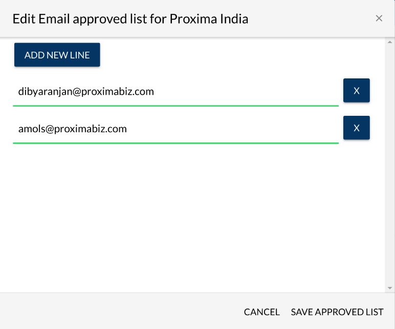
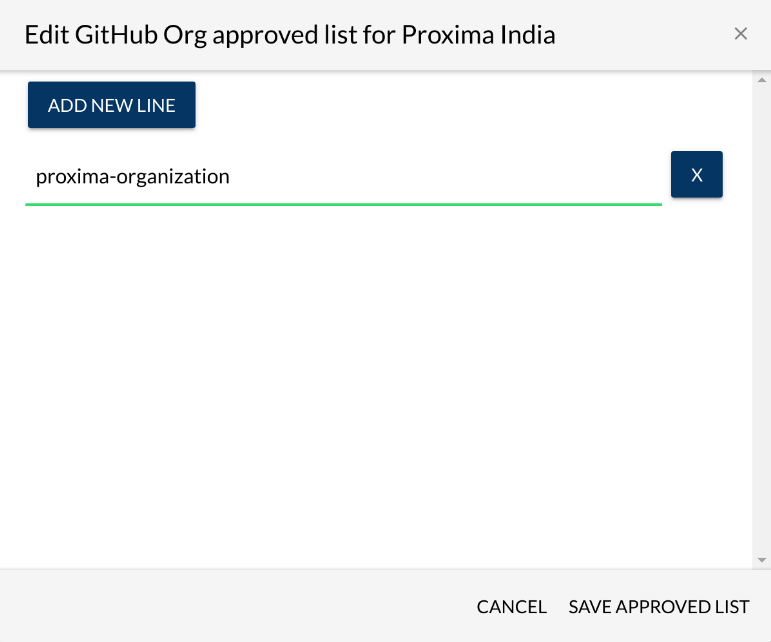

# Approve Contributors


You will receive an email after a contributor sends a request to be added to the Approved list. To approve them, you must add their email address or GitHub username to the Approved list.


You can approve contributors by adding them to the Approved List. **Approved Lists** are lists of domain names, email addresses of individuals, GitHub usernames, or GitHub organization names who are authorized to contribute under a signed Corporate CLA. As a CCLA manager, you allow contributions to projects on behalf of your company by using any approved list:

* Domain Approved List allows entities to contribute under any email address under that domain name.
* Email Approved List allows entities to contribute under an individual email address.
* GitHub Approved List allows entities to contribute under a GitHub username.
* GitHub Organization Approved List allows entities to contribute under a GitHub organization name.

Each approved list applies to the project for which the company has signed a Corporate CLA. The CLA application checks all the approved lists for allowing contributions to a company project. A contributor only needs to be on one approved list. Contributors can use EasyCLA to send email requests to be associated \(authorized\) with the company.

**To Approve Contributors:**

1. ​[Sign in](sign-in-to-the-cla-corporate-console.md) to the corporate console.

2. The CLA Corporate Console appears and shows Companies.

3. Click a **company** of interest.

4. The CLA Corporate Console appears and shows projects with signed CLAs.

5. Click **MANAGE APPROVED LIST** for a ****CLA ****under which you want to add a contributor.  
You can identify a recent request for a CLA by seeing the value as 1 under Pending Contributor Requests column. Following is an example:

6. Under **Pending Contributor Requests**, click **ACCEPT**, and then click **APPROVE REQUEST** on the confirmation window to add the contributor to the approved list or click **DECLINE** to decline the contributor's request to be added.  
The contributor receives an e-mail notification about the status.

**Result:** If you click **ACCEPT**, the contributor will be added to the list, and is removed from the Pending Contributor Requests section.

7. \(Optional\) You can edit a contributor's approved list details by:

* [Domain Approved List , Email Approved List, or GitHub Approved List](approve-contributors.md#domain-whitelist-email-whitelist-or-github-whitelist)
* [GitHub Organization Approved List](approve-contributors.md#github-organization-whitelist)

## Domain Approved List , Email Approved List, or GitHub Approved List 

The corresponding Edit _domain/email/github_ approved list dialog lets you add, edit, and delete values to the approved list so that employees \(developers\) can be associated to the company. An example domain name value is joesbikes.com. A wildcard approves/authorizes the domain and all subdomains, for example: \*.joesbikes.com or \*joesbikes.com would authorize joes.bikes.com, shop.joesbikes.com, and blog.joesbikes.com.

**Note:** To remove an entry from the approved list, click **X** next to the item, and click **SAVE**.

1. Click the edit icon\( **pencil** \) next to the approved list that you want to edit:
2. Click **ADD DOMAIN/EMAIL/GITHUB**, enter a **domain name**, **email address**, or **GitHub username** for the employees for who you want to authorize, and click **SAVE APPROVED LIST**. For example:

Your entries appear in their corresponding approved lists.

## GitHub Organization Approved List 

The GitHub Organization Approved List lets you add or remove organizations from an approved list so that company employees can contribute to project—the CLA service checks the GitHub organizations that the user belongs to.

_**Requirements:**_

Each member of your organization must ensure that these items are Public in their GitHub Profile:

* Their membership with the organization. Each Private member should follow this [procedure](https://help.github.com/en/articles/publicizing-or-hiding-organization-membership) to make their membership Public.
* The associated email address for the organization member. Each Private member should make their associated email address Public \(members can have multiple emails in their Profile, so they must select the appropriate one\).

**To Add or Remove an Organization from Approved List:**

1. Click the edit icon \(**pencil\)** next to Github Org Approved List.  
    The Edit Github Organization Approved List dialog appears.

**Note:** Click **CONNECT GITHUB** if the organization you want to authorize is not listed in the dialog. The Add GitHub Organization dialog appears and lets you specify the GitHub organization.

2. To Add, type a GitHub organization name in the field, select from drop-down, and click **SAVE APPROVED LIST**. 

3. To remove, click  next to the organization that you want to add/remove, respectively.

Your organizations appear in their organization approved list.

