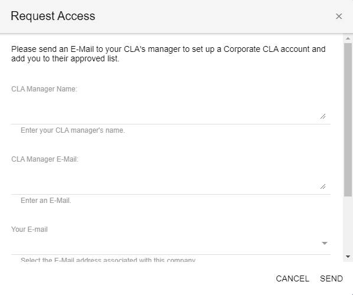

# Corporate Contributor

As a corporate \(employee\) contributor, you are contributing code on company's behalf. When Corporate CLA is signed for the project, you confirm your association with the company during your first pull request or change submit. Your subsequent contributions will neither require association confirmations nor will they be gated by CLA check.

* [GitHub](corporate-contributor.md#github)
* [Gerrit](corporate-contributor.md#gerrit)

## GitHub

1. In GitHub, go to the repository that is linked to the project for your organization.

2. Make a change and send a pull request.


* EasyCLA checks your CLA status. It marks a cross or a tick beside your name based on your CLA status.
* A cross next to your contributor name means the CLA check failed.


3. Click   or **Please click here to be authorized**.  
**Note:** The Authorize Linux Foundation: EasyCLA dialog appears.

4. Click **Authorize LF-Engineering**. \(Subsequent contributions will not require authorization.\)

​​  

5. The CLA Contributor Console appears and shows the CLA group for your project.

6. Select **Company**.  
**Note:** To contribute to this project, you must be added to an approved list by the CLA manager under a signed Contributor License Agreement. You are contributing on behalf of your work for a company.

7. Continue:

* [If Confirmation of Association statement appears](corporate-contributor.md#if-confirmation-of-association-statement-appears)
* [If you are not added to the approved list](corporate-contributor.md#if-you-are-not-added-to-the-approved-list)
* [Verify Your Permission of Access window appears](corporate-contributor.md#verify-your-permission-of-access)
* [If your company is not in the list](corporate-contributor.md#if-your-company-is-not-in-the-list)

## Gerrit

1. In Gerrit, clone a repository under the Gerrit instance into your local machine.

2. Make a change and push the code to your Gerrit repository.

3. A warning link that you need to sign a CLA appears:

4. Navigate to the Gerrit instance of your project. For example, if you are contributing to OPNFV project, navigate to [https://gerrit.opnfv.org](https://gerrit.opnfv.org/)​

5. Sign in using your [Single Sign-On \(SSO\)](../../sso/sign-in/) account.

6. Navigate to **Settings**— the gear icon on the upper right corner, and click **Agreements** from the menu on the left:

​​    ​​

7. Click **New Contributor Agreement**.

8. Select **Corporate CLA**, and click **Please review the agreement**.

9. Sign in to EasyCLA if you are prompted.

10. Continue:

* [If Confirmation of Association statement appears](corporate-contributor.md#if-confirmation-of-association-statement-appears)
* [If you are not added to the approved list](corporate-contributor.md#if-you-are-not-added-to-the-approved-list)
* [Verify Your Permission of Access window appears](corporate-contributor.md#verify-your-permission-of-access)
* [If your company is not in the list](corporate-contributor.md#if-your-company-is-not-in-the-list)

11. After you complete signing the CLA, navigate to gerrit window, sign out from gerrit, and sign in again for the CLA status to be updated.

## If Confirmation of Association statement appears

This message appears if you are added to the approved list, and your CLA doesn't require you to sign ICLA. If the CLA is configured for you to sign ICLA, you will be redirected to sign an Individual CLA, as shown in [step 5 of sign ICLA](individual-contributor.md#github).

1. Read the Confirmation of Association statement and select the checkbox.

2. Click **CONTINUE**.

A dialog appears and informs you: You are done!

3. Click **RETURN TO REPO**.

You are redirected to GitHub. Wait a few seconds for the CLA status to update or refresh the page.

## If you are not Added to the Approved List

You must be added to the approved list under a signed CCLA before you can contribute to the project.

**To contact your CLA manager to add you to the approved list:**

1. Click **CONTACT** under Contact the CLA Manager to be approved under their signed Corporate CLA.

2. Select an option, and complete the form.

3. Click **SEND**.  
A message appears informing you that the e-mail is sent successfully.


You will receive an email notification if the CLA manager approves or rejects your request to be approved as a corporate contributor for the company.


## Verify Your Permission of Access

If your company has not signed CLA, Verify Your Permission window appears. To proceed:

1. Click an answer: Are You a CLA Manager?

   **YES**— You will be redirected to the [CLA Corporate Console](https://corporate.v1.easycla.lfx.linuxfoundation.org/) to [sign a CLA](../cla-manager/sign-a-corporate-cla-for-company.md).

   **NO**— A **Request Access** form appears. Continue to next step.  
     

2. Complete the form and click **SEND**.

   The CCLA manager signs a Corporate CLA and adds you to the approved list.

## If Your Company is not in the List

If you don't find your company's name in the list:

1. Click **COMPANY NOT IN LIST? CLICK HERE**.

   The **Verify Your Permission of Access** dialog appears.

2. Click an answer: Are You a CLA Manager?

   **YES**— You will be redirected to the [CLA Corporate Console](https://corporate.v1.easycla.lfx.linuxfoundation.org/) to [add your company](../cla-manager/add-a-company-to-a-project.md) to a project.

   **NO**— A **Request Access** form appears. Continue to next step.  
     

3. Complete the form and click **SEND**.

   The CCLA manager signs a Corporate CLA and adds you to the approved list.

