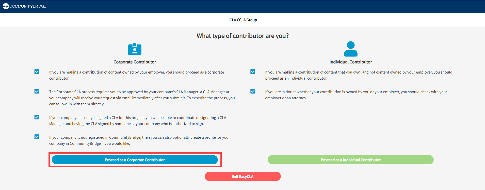
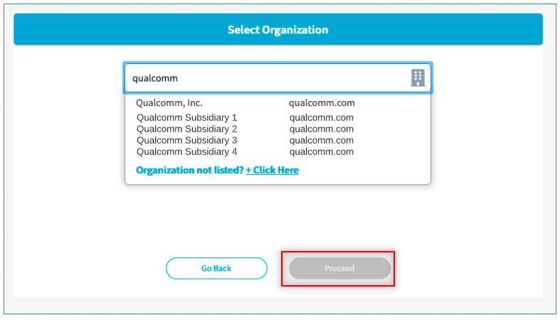
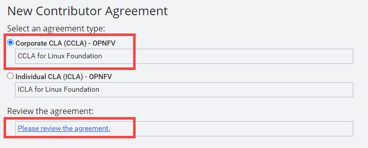
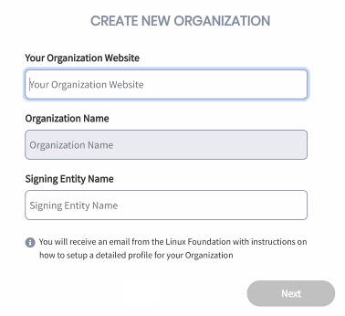
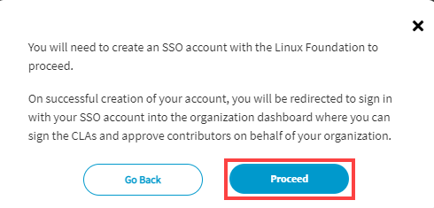
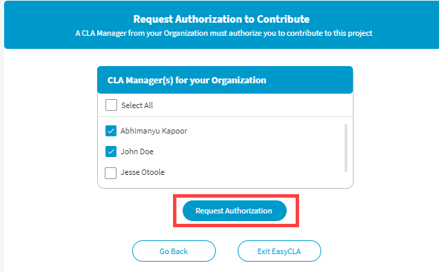
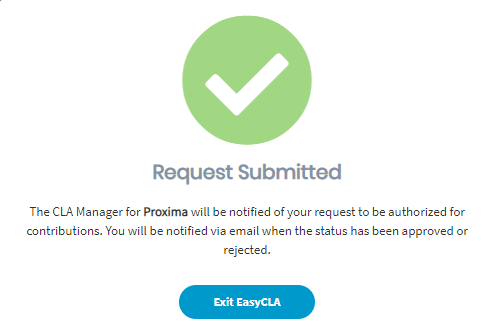

# Corporate Contributor

A corporate contributor is one who contributes code on behalf of their employer \(and not on their own behalf\). If you are contributing code on your own behalf, please see the [Individual Contributor](individual-contributor.md) workflow.

Upon creating a pull request in GitHub or merge request in GitLab or submitting changed code in Gerrit, EasyCLA will check whether the contributor is authorized under a signed CLA for that project. If they are not, and if they are contributing on behalf of their employer, then they will need to be authorized under a signed Corporate CLA \(CCLA\):

* If their company has not yet signed a CCLA, then the contributor can start the workflow for the signing process.
* If the contributor has not yet been added to the authorized contributors list by their company's CLA Manager, then the contributor can submit a request to their CLA Manager to be added.
* If the CCLA has been signed and the contributor is on the authorized contributors list, then the contributor will need to confirm their association with the company, and then will be able to proceed.
* [GitHub](corporate-contributor.md#github)
* [Gerrit](corporate-contributor.md#gerrit)
* [GitLab](corporate-contributor.md#gitlab)

## GitHub

1. In GitHub, go to the repository that is linked to your project.
2. Make a code change and create a pull request.
3. EasyCLA checks the CLA status of all committers involved in that pull request.


1. EasyCLA displays a cross or a check mark beside the name of each contributor involved in that pull request based on their CLA status.
2. A cross next to a contributor's name means the EasyCLA check has failed, because the contributor is not authorized under a signed CLA.


4. Click  or **Please click here to be authorized**.

5. Click **Authorize LF-Engineering**. \(Subsequent contributions will not require authorization.\)

**Result:** The CLA Contributor Console appears in a new tab.

​  ​

6. Click **Proceed as a Corporate Contributor**.

7. On **Select Organization** window, type your company's name in the field, select it from the drop-down list, and click **Proceed**.


**Note:**

* If your company is not in the list, you can add the company as described in [If your company is not in the list](corporate-contributor.md#if-the-select-company-dialog-appears).


8. You will need to complete one of the following workflows:

* [If your company is not in the company list](corporate-contributor.md#if-the-select-company-dialog-appears)
* [If your company has not yet signed a CCLA](corporate-contributor.md#if-company-has-not-signed)
* [If you have not yet been added to your company's approved list](corporate-contributor.md#if-you-are-not-added-to-the-approved-list)
* [If you are additionally asked to sign an ICLA](corporate-contributor.md#if-you-are-asked-to-sign-icla)

## Gerrit

1. In Gerrit, clone a repository under the Gerrit instance into your local machine.
2. Make a change and push the code to your Gerrit repository.
3. A warning link that you need to sign a CLA appears if CLA is not signed for the project:

4. Navigate to the Gerrit instance of your project. For example, if you are contributing to the ONAP project, navigate to [https://gerrit.onap.org](https://gerrit.onap.org/r/q/status:open+-is:wip)

5. Sign in using your LF [Single Sign-On \(SSO\)](https://docs.linuxfoundation.org/lfx/sso/create-an-account) account.

6. Navigate to **Settings** -— the gear icon on the upper right corner -- and click **Agreements** from the menu on the left:

​​ ​​

7. Click **New Contributor Agreement**.

8. Click **Corporate CLA**, and then click the **Please review the agreement** link.

9. Click **Proceed To Corporate Authorization**.

**Result:** You are redirected to the EasyCLA Corporate Console. Sign in with your LF SSO account if prompted.

10. On **Select Organization** window, type your company's name in the field, select it from the drop-down list, and click **Proceed**.

11. You will need to complete one of the following workflows:

* [If your company is not in the company list](corporate-contributor.md#if-your-company-is-not-in-the-list)
* [If your company has not yet signed a CCLA](corporate-contributor.md#if-company-has-not-signed)
* [If you have not yet been added to your company's approved list](corporate-contributor.md#if-you-are-not-added-to-the-approved-list)
* [If you are additionally asked to sign an ICLA](corporate-contributor.md#if-you-are-asked-to-sign-icla)

## GitLab

1. In GitLab, clone the repository you want to contribute to.
2. Make changes, commit change and create merge request.
3. EasyCLA checks the CLA status of all committers involved in that pull request.


1. EasyCLA displays a cross or a check mark beside the name of each contributor involved in that pull request based on their CLA status.
2. A cross next to a contributor's name means the EasyCLA check has failed, because the contributor is not authorized under a signed CLA.


4. Click  or **Not Covered**.

5. Click **Authorize LF-Engineering**. \(Subsequent contributions will not require authorization.\)

**Result:** The CLA Contributor Console appears in a new tab.

​  ​

6. Click **Proceed as a Corporate Contributor**.

7. On the **Select Organization** window, type your company's name in the field, select it from the drop-down list, and click **Proceed**.


**Note:**

* If your company is not in the list, you can add the company as described in [If your company is not in the list](corporate-contributor.md#if-your-company-is-not-in-the-list).


8. You will need to complete one of the following workflows:

* [If your company is not in the company list](corporate-contributor.md#if-your-company-is-not-in-the-list)
* [If your company has not yet signed a CCLA](corporate-contributor.md#if-company-has-not-signed)
* [If you have not yet been added to your company's approved list](corporate-contributor.md#if-you-are-not-added-to-the-approved-list)
* [If you are additionally asked to sign an ICLA](corporate-contributor.md#if-you-are-asked-to-sign-icla)

## If your Company is not in the list

1. Click **+Click Here** next to the **Organization not listed?**

2. Provide organization website URL, and organization name in the respective fields.  
**Note:** If the website URL is already associated with an organization, the organization name appears in the **Organization Name** field, and you cannot edit the name.

3. Click **Next**.

4. Click an answer: **Are you authorized to be a CLA Manager for your organization?**

* **Yes:** Follow the procedure, and click **Proceed** to [coordinate the CCLA signing process](../corporate-cla-managers/coordinate-signing-ccla.md).
* **No:** Provide name and email address of the person who is authorized to be the CLA Manager from your company for this project, and click **Submit Request**. If you do not know who should be the CLA Manager from your company for this project, you should consult with your management or legal department to confirm.

  **Note:** After the authorized person signs CLA, and adds you to the approved list, you must [complete your company acknowledgement](corporate-contributor.md#acknowledge-company-contribution) before you can contribute.

## If your Company has not yet signed a CCLA 

If your company has not yet signed a CLA, the **No Signed CLA Found** window appears after selecting your company.

1. Click an answer: **Are you authorized to be a CLA Manager for your organization?**

* [Yes ](corporate-contributor.md#yes-if-you-will-become-the-initial-cla-manager)— By clicking **Yes**, you will become the initial CLA Manager after the CCLA is signed.
* [No](corporate-contributor.md#no-if-someone-else-will-become-the-initial-cla-manager) — By clicking **No**, you will enter the details of someone else who will become the initial CLA Manager.

### **Yes \(If you will become the initial CLA Manager\)**

1. Click **Proceed** on the window that appears.


**Note:** If you don't have a username \(LF SSO Account\) associated with The Linux Foundation, you will be redirected to the LF SSO Account creation page.


2. Click **Proceed** again.

3. You will be redirected to the corporate console to [coordinate the CCLA signing process](../corporate-cla-managers/coordinate-signing-ccla.md).


**Important:** After the CCLA is signed, you will be the initial CLA Manager, but by default you will not also be an authorized contributor. In order to contribute to the project, you must then [add yourself to the approved list](../corporate-cla-managers/approve-and-manage-contributors.md#add-contributor-s), and [complete the company acknowledgement](corporate-contributor.md#acknowledge-company-contribution).


### **No \(If someone else will become the initial CLA Manager\)**

1. An **Identify CLA Manager** window appears. 
2. Complete the form, and click **Submit Request**. If you don't know the email address of the person who should become the CLA Manager of your company, then \(unless you just created the company record\) you can click the **Contact Company Admin** link, which may let you reach out to your company's LFX administrative contact if your company has set someone up with this role.
3. Click **Exit EasyCLA**. You can contribute after your company signs the project's CCLA, and the CLA Manager adds you to the approved list.


**Important:** You will receive an email after the CLA Manager adds you to the approved list. After you are added to the approved list, you must [complete your company acknowledgement](corporate-contributor.md#acknowledge-company-contribution) before you can contribute to the project.


## If you have not yet been added to the approved list 

If your company has signed a CCLA, but you have not yet been added to the approved list, the **Request Authorization to Contribute** window appears that shows the CLA Manager\(s\) for your company.

1. Select one or more CLA Managers from the drop-down list whom you want to request to add you to the authorized list.

2. Click **Request Authorization**.  

3. Click **Exit EasyCLA**.


**Important:** You will receive an email after the CLA Manager adds you to the approved list. After you are added to the approved list, you must [complete your company acknowledgement](corporate-contributor.md#acknowledge-company-contribution) before you can contribute to the project.


## Acknowledge Company Contribution

After the CCLA is signed and the CLA Manager adds you to the approved list, you must re-select your company association before you can contribute code under that company's signed CCLA.

### For GitHub and GitLab:

1. Navigate to the GitHub PR page or GitLab merge request page.
2. Click **Not Covered**, and then click **Proceed as a Corporate Contributor**.
3. On the **Select Organization** window, select your company, and click **Proceed**.

A window appears confirming your association with the company. Click **Exit EasyCLA**, and you will be redirected back to the GitHub or GitLab page where the CLA status will be updated. If it does not immediately update, please wait a moment and then refresh the page.  

### For Gerrit:

Navigate to the Gerrit instance of your project, and re-complete the procedure by following [step 4 through step 10 as described above for Gerrit](corporate-contributor.md#gerrit) to complete company acknowledgement.

A window appears confirming your association with the company. Click Exit EasyCLA, and start contributing.


**Important:** If the status on Git command line still shows "No contributor agreement" when you push the code change, you need to navigate to the Gerrit window, **sign out**, **sign in** again, and then push the code.

   


## If you are additionally asked to sign an ICLA 

For certain projects, in addition to being authorized under your company's signed CCLA, you may also be required to individually sign an ICLA on your own behalf.

1. If this is the case for your project, then after your CLA Manager adds you to the approved list, and after you [complete your company acknowledgement](corporate-contributor.md#acknowledge-company-contribution), then the following screen appears: 
2. Click **Proceed**.
3. On **CLA Ready For Signature** window, click **SIGN CLA**. 
4. Follow the instructions in DocuSign, sign the ICLA, and click **FINISH**.


* **GitHub/GitLab Contributors:** Navigate to the GitHub/GitLab page. Wait a few seconds for the CLA status to be updated or refresh the page.
* **Gerrit Contributors:** If the status on Git command line still shows "No contributor agreement" when you push the code change, you need to navigate to the Gerrit window, **sign out**, **sign in** again, and then push the code.

  


