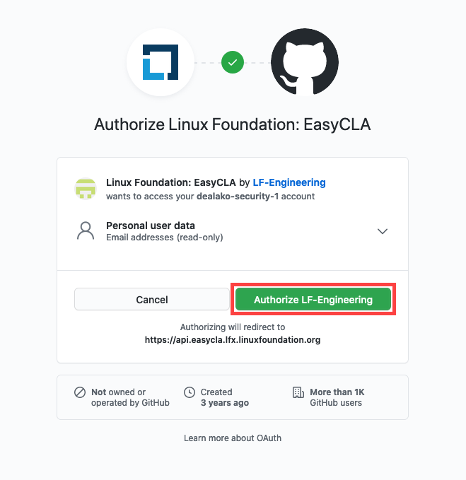
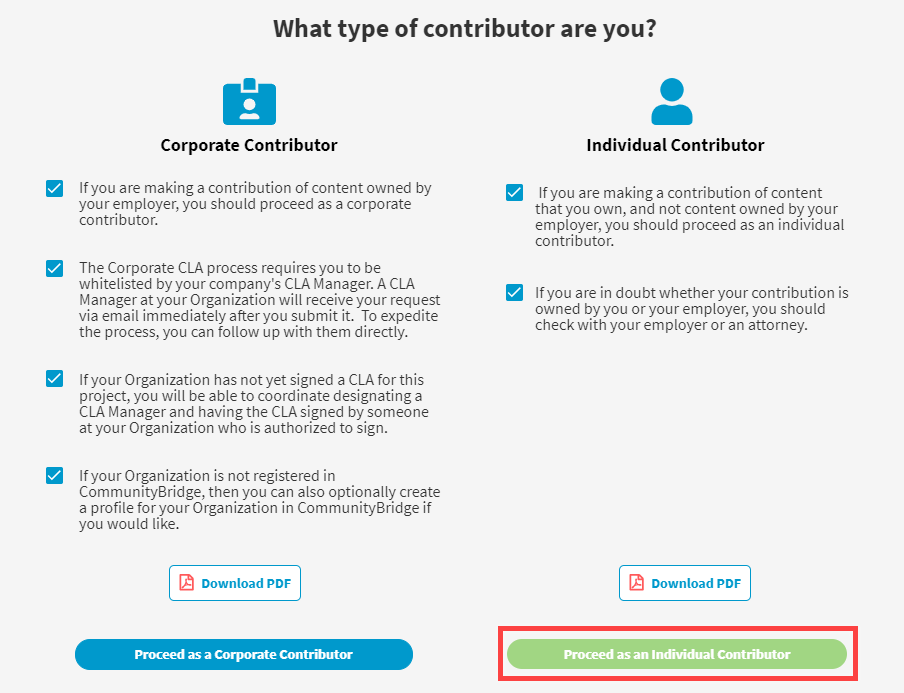
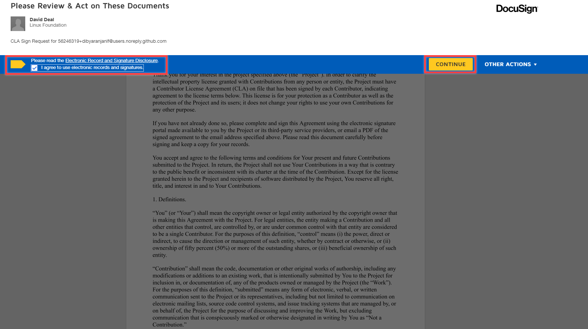

# Individual Contributor

An individual contributor is one who contributes code on their own behalf \(and not on behalf of an employer\). If you are contributing code on behalf of your employer, please see the [Corporate Contributor](corporate-contributor.md) workflow.

Upon creating a pull request in GitHub or submitting changed code in Gerrit, EasyCLA will check whether the contributor is authorized under a signed CLA for that project. If they are not, and if they are contributing on their own behalf, then they must sign an ICLA.

* [GitHub](individual-contributor.md#github)
* [Gerrit](individual-contributor.md#gerrit)

## GitHub

1. In GitHub, go to the repository where you are contributing code.
2. Make a change and create a pull request.


1. EasyCLA checks the CLA status of all committers involved in that pull request. EasyCLA displays a cross or a check mark beside the name of each contributor who is involved in that pull request based on their CLA status.
2. A cross next to a contributor's name means the EasyCLA check has failed, because the contributor is not authorized under a signed CLA.


3. Click or **Please click here to be authorized**.

4. Click **Authorize LF-Engineering**. \(Subsequent contributions will not require this authorization.\)

​  ​

The CLA Contributor Console appears and shows the CLA group for your project.


**Note:** If the project is not configured to use ICLAs, then **Proceed as an Individual Contributor** is inactive. In this case, individuals would not be able to contribute on their own behalf.


5. Click **Proceed as an Individual Contributor**.  

6. After the **CLA Ready For Signature** window appears, click **SIGN CLA**.

DocuSign presents the ICLA document for your signature.

7. Select the check box and click **CONTINUE**. Follow the instructions in the DocuSign document, fill in the indicated fields, sign it, and click **FINISH**.


**Result:**

* You will receive an email from The Linux Foundation, informing you that you have signed the ICLA. 
* You can download the PDF document by clicking the link from the email. You will be re-directed to the Linux Foundation's website. If the download doesn't start automatically, click **Proceed to Download**.  


You are redirected to GitHub. Wait a few seconds or refresh the page for the EasyCLA status to be updated. A check mark appears next to your branch.

8. Click **Merge pull request** and confirm the merge.

## Gerrit

1. In Gerrit, clone a repository under the Gerrit instance into your local machine.
2. Make a change and push the code to your Gerrit repository.
3. A warning link that you need to sign a CLA appears:

4. Navigate to the Gerrit instance of your project. For example, if you are contributing to the OPNFV project, navigate to [https://gerrit.opnfv.org](https://gerrit.opnfv.org/)​

5. Sign in using your LF [Single Sign-On \(SSO\)](https://docs.linuxfoundation.org/lfx/sso/create-an-account) account.

6. Navigate to **Settings**— the gear icon on the upper right corner— and click **Agreements** from the menu on the left:

​​ ​​

7. Click **New Contributor Agreement**.

8. Select **Individual CLA \(ICLA\)**, and click **Please review the agreement**.

9. Click **Proceed To Individual Authorization**.

10. Sign in if you are prompted, and you will be redirected to the Contributor Console.

11. After CLA preparation is completed, click **Sign CLA**.

DocuSign presents the ICLA document for your signature.

12. Select the check box and click **CONTINUE**. Follow the instructions in the DocuSign document, fill in the indicated fields, sign it, and click **FINISH**.


**Result:**

* A message appears informing you that you have signed the ICLA.
* You will also receive an email from The Linux Foundation, informing you that you have signed the ICLA. 
* You can download the PDF document by clicking the link from the email. You will be redirected to the Linux Foundation's website. If the download doesn't start automatically, click **Proceed to Download**.  


13. Navigate to the Gerrit project, and start contributing.


**Note:** If you still see the EasyCLA status not updated, sign out from Gerrit and sign in again, and then follow the procedure again to submit the change.


