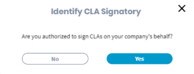
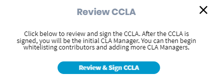
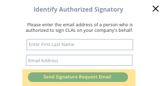
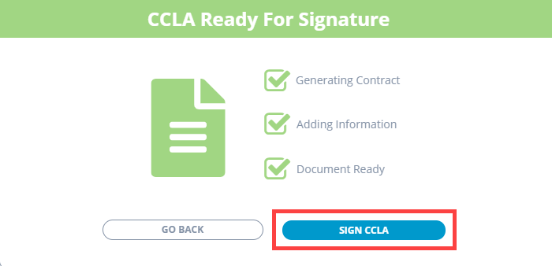
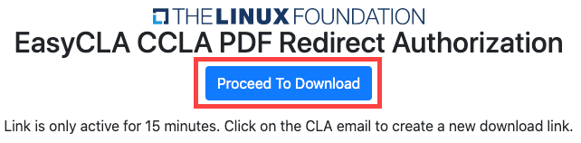

# Sign Corporate CLA for a Company

As a CCLA manager designee \(initial CLA manager\), you must sign a Corporate CLA before you can manage contributors of your company, and add other CLA managers. You become a[ CCLA manager](../corporate-cla-managers/) after you sign CLA as a CLA manager designee.

1. [Sign in](../corporate-cla-managers/sign-in-to-the-easycla-corporate-console.md) to the [corporate console](http://member.lfx.linuxfoundation.org/).

2. Click the project for which you want to sign CLA, navigate to **Tools &gt; CLA,** and click **Start the CLA Process**.  
**Note:** If you are already designated as a CLA manager designee for a project, details appear as shown in step 5.  

3. Click an answer: **Are you authorized to be a CLA Manager for your organization?**  
  

* **Yes**— Continue to step 5.
* **No**— An **Identify CLA Manager** form appears. Continue to next step.    

4. Enter first and last name, email address, and click **Submit Request**, Or click **Contact Company Admin** if you are not sure who should sign the corporate CLA.


The individual must have an [LF SSO](https://docs.linuxfoundation.org/lfx/sso) account to sign CLA.


5. You are designated as the initial CLA manager \(CLA manager designee\). Under **Action** column, click **Proceed with Signing**.  
**Result:** Identify CLA Signatory window appears.

6. Click an answer: **Are you authorized to sign CLAs on your company's behalf?**  
  

* **Yes**— **Review CCLA** window appears. Click **Review & Sign CCLA**, and continue to step 8.   **** 
* **No**— An **Identify Authorized Signatory** form appears. Continue to next step.   

7. Complete the form, and click **Send Signature Request Email**.  
**Result:** A success window appears confirming that the signature request is sent to the email address of the individual who signs the Corporate CLA on behalf of the company. After CLA is signed, you are designated as the CLA manager, and that individual becomes CLA signatory for your company.

8. **Preparing CCLA** window appears. After CCLA preparation is completed, click **SIGN CCLA** on CCLA Ready for Signature window.  
**Result:** You will be redirected to complete the DocuSign process.

9. Select the checkbox, click **CONTINUE**,  and follow the instructions in the DocuSign document, sign it, and click **FINISH**.


* You receive an email from The Linux Foundation, informing you that you have signed the CLA. 
* You can download the PDF document by clicking the link form the email. You will be redirected to Linux Foundation's website. If the download doesn't start automatically, click **Proceed to Download**.   


**Result:** You become the CLA manager for your company. You will be redirected to the project page, and your name and email address appear under **CLA MANAGERS FROM MY ORGANIZATION**. Following is an example:

After you become the CLA manager, you can [add individuals as CLA managers](../corporate-cla-managers/add-or-delete-cla-managers.md), and [approve contributors](../corporate-cla-managers/approve-and-manage-contributors.md) to contribute to the project.

