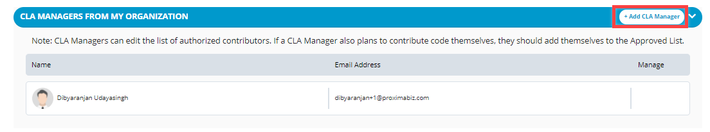
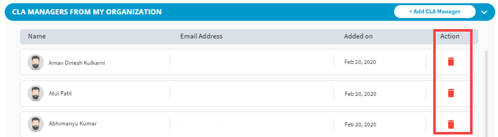

# Add or Delete CLA Managers


**Important:** If a project has one CLA manager, the person's details cannot be deleted.


As a CLA manager, you can:

* [Add a CLA manager](add-or-delete-cla-managers.md#add-a-cla-manager)
* [Delete a CLA manager](add-or-delete-cla-managers.md#delete-a-cla-manager)

### Add a CLA Manager:

1. [Sign in](sign-in-to-the-cla-corporate-console.md) to the corporate console.

2. Navigate to the project for which you want to add CLA managers.

3. Navigate to **CLA MANAGERS FROM MY ORGANIZATION** section, and click **+ Add CLA Manager**.

4. On **Adding CLA Manager** window, type first name, last name, email address, and click **Add**.

4. **Results:**

* **If the user, being added, has LF Login:** A screen appears confirming that the user is successfully added as a CLA manager.  
* **If the user, being added, doesn't have LF Login:** A request is sent to the user's email address with the link to create an LFID. After the user creates an LFID, you must [add](add-or-delete-cla-managers.md) the user as a CLA manager. 

### Delete a CLA Manager:

Click  under **Manage** column on a CLA manager's row to delete the user. There will always be one CLA Manager, the last undeleted CLA Manager cannot be deleted.

