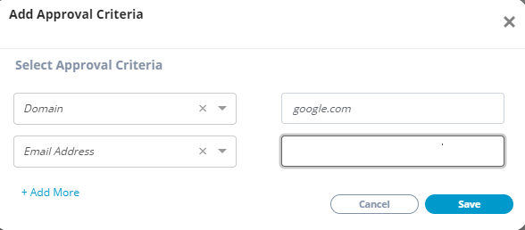

# Approve and Manage Contributors


You may receive an email after a contributor sends a request to be added to the Approved list. To approve them, you must add their email address or GitHub username to the approved list.


You can approve contributors by adding them to the Approved List so that they can contribute to the project under a signed corporate CLA. **Approved Lists** are lists of domain names, email addresses of individuals, GitHub usernames, or GitHub organization names that allows contributors to be authorized to contribute under a signed corporate CLA.

As a CLA manager, you can:

* [Add Contributors](approve-and-manage-contributors.md#add-contributor-s)
* [Edit a Contributor's Details](approve-and-manage-contributors.md#edit-a-contributors-details)
* [Delete a Contributor's Details](approve-and-manage-contributors.md#delete-a-contributors-details)

### **Add Contributor\(s\)**

1. ​[Sign in](sign-in-to-the-cla-corporate-console.md) to corporate console.  
The CLA Corporate Console appears and shows projects your company is associated with.

3. Click a **project** of interest.

5. Click **+ Add Approval Criteria** under **APPROVED LIST OF CONTRIBUTIONS FROM MY ORGANIZATION**.

6. On **Add Approval Criteria** window, select an option from the **Select Type** drop-down list, and type details in the filed for the value that you selected.

3. Click **+Add More** to add other details for a contributor.


**Note:** 

* Domain allows contribution under any email address under that domain name.
* Email Address allows contribution under an individual email address.
* GitHub Username allows contribution under a GitHub username.
* GitHub Organization allows contribution under a GitHub organization name.

GitHub Organization and GitHub Username are not required while adding contributors to Gerrit projects.


4. Click **Save** to add the contributor.

The added contributor is displayed under Approved List of Contributors from my 

### Edit a Contributor's Details

Click  next to a contributor's row, make edits, and click **Save**.

### Delete a Contributor's Details

Click  under Manage column on a contributor's row to delete the contributor's details.

