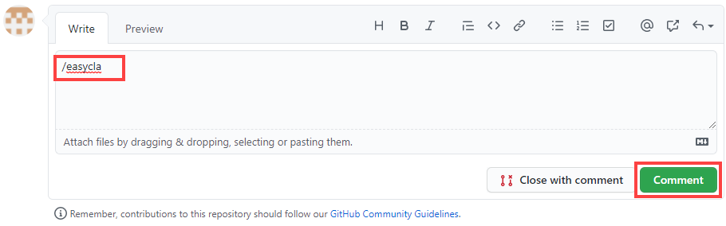

# EasyCLA Troubleshooting

> If you are having issues with EasyCLA, go to [The Linux Foundation Support Center](https://jira.linuxfoundation.org/plugins/servlet/theme/portal/4/create/143), and file a ticket.

Following sections help you troubleshoot common problems that you might encounter when using EasyCLA tool.

* [GitHub pull request is not passing](./#github-pull-request-is-not-passing)
* [\(GitHub\) Unable to contribute to EasyCLA-enforced repositories](./#github-unable-to-contribute-to-easycla-enforced-repositories)
* [\(Gerrit\) Unable to contribute to EasyCLA-enforced repositories](./#gerrit-unable-to-contribute-to-easycla-enforced-repositories)
* [Contributor's EasyCLA status is not updated](./#contributors-easycla-status-is-not-updated)
* [Corporate contributor's EasyCLA status is not updated even after added to the approved list](./#problem-corporate-contributors)
* ​[EasyCLA is Disabled for a GitHub repository](easycla-is-disabled.md)​

## GitHub pull request is not passing

#### Problem:

I have an agreement on file, but EasyCLA does not authorize me and displays "Missing ID on Commit".

#### Solution:

* Ensure that your commits are [linked to your GitHub account](https://docs.github.com/en/github/committing-changes-to-your-project/why-are-my-commits-linked-to-the-wrong-user#commits-are-not-linked-to-any-user). If your commits are not linked to any GitHub user, GitHub will display the _grey Octocat logo_  beside the commits. 
* If your commits are linked to your GitHub account, and yet the GitHub pull request is not passing the EasyCLA check, then open the pull request, type`/easycla` in the comment box, click **Comment**, and run the EasyCLA bot again. Following is the image for clarity:

## \(GitHub\) Unable to contribute to EasyCLA-enforced repositories

### Problem:

Contributor's commits are linked to GitHub account, however, they are still having trouble contributing to EasyCLA-enforced repositories.

#### Solution:

* If your CLA Manager has approved your company email address or email domain, ensure that your company email is[ verified in your GitHub account settings](https://docs.github.com/en/github/getting-started-with-github/verifying-your-email-address) and make sure your GitHub email address is public.

Or

* If your CLA Manager has approved your GitHub Organization,[ ensure that you have made that membership public](https://docs.github.com/en/github/setting-up-and-managing-your-github-user-account/publicizing-or-hiding-organization-membership).

## \(Gerrit\) Unable to contribute to EasyCLA-enforced repositories

### Problem:

Contributor's commits are linked to Gerrit account, however, they are still having trouble contributing to EasyCLA-enforced repositories.

#### Solution:

Ensure that your Gerrit email address is added to the approved list, and you must log in to Gerrit instance of your project using the same email address that is added to the approved list.

## \(GitHub\) Individual Contributor's EasyCLA status is not updated

### Problem:

After a Contributor has signed an ICLA, EasyCLA status is not updated on contributor console.

### Solution:

It may take a few moments for the status of the EasyCLA checks to update. Please wait a few moments and then refresh the page.

## \(Gerrit\) Individual Contributor's EasyCLA status is not updated

### Problem:

After a Contributor has signed an ICLA, EasyCLA status is not updated on contributor console.

### Solution:

If the status on Git command line still shows "_No contributor agreement_" when you push the code change, then you need to navigate to the Gerrit window, **sign out**, **sign in** again, and then push the code.  
 

## \(GitHub\) Corporate Contributor's EasyCLA status is not updated

### Problem:

For a CCLA, after a Contributor has been added to the approved list for the first time, the CLA status still displays **Not Covered** for GitHub and **No Contributor Agreement** for Gerrit.

#### Solution:

After being added to the approved list under their company's signed CCLA, the Contributor must [acknowledge their association with the company](../../contributors/corporate-contributor.md#acknowledge-company-contribution). This is a one-time action and, after completion, it will not be required for future contributions to that project.

Although it is uncommon, some projects may require a Contributor under a CCLA to additionally [sign an ICLA](../../contributors/corporate-contributor.md#if-you-are-asked-to-sign-icla). If this is required, then after completing the company acknowledgement, the Contributor will be guided to sign the project's ICLA.

## \(Gerrit\) Corporate Contributor's EasyCLA status is not updated

**Important \(Only for Gerrit Contributors\) :** If the status on Git command line still shows "No contributor agreement" when you push the code change, you need to navigate to the Gerrit window, **sign out**, **sign in** again, and then push the code.

**Problem:**

In the “Checks” section of the pull request, EasyCLA status is showing as “Expected”. 

**Solution:**

Open the pull request, and comment `/easycla` in the comment section. This comment runs the bot again. If the status still does not change, open a support ticket.

**Problem:**

A contributor has multiple open pull requests and after signing an ICLA or verifying under a CCLA, the status does not change to “Authorized” on all of them.

**Solution:**

Open the pull request, and comment `/easycla` in the comment section. This comment runs the bot again. If the status still does not change, open a support ticket.  

