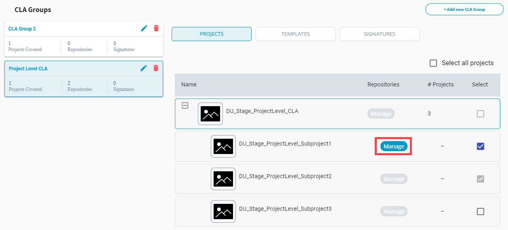
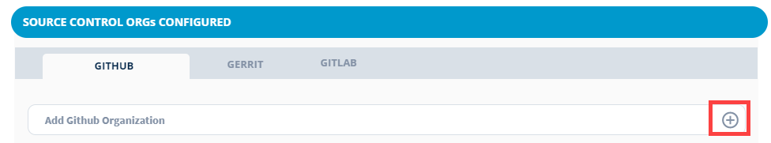
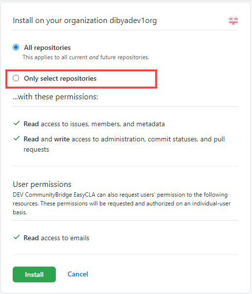
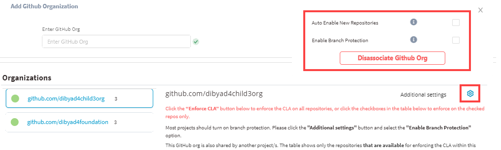
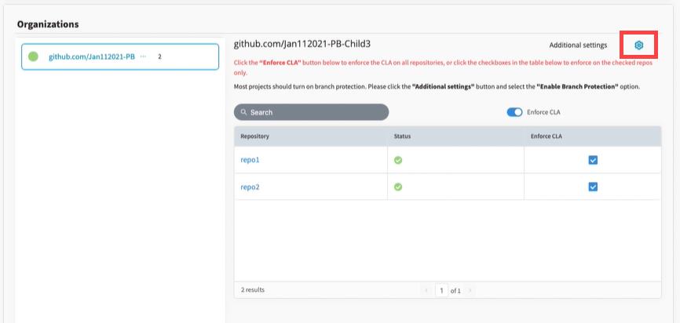
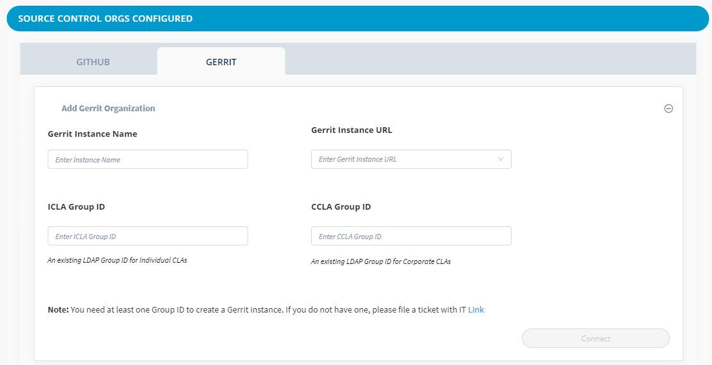
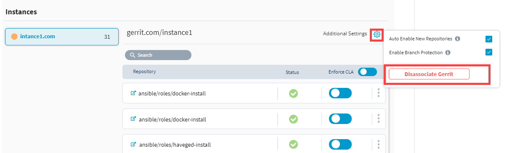

# Add and Manage Git Organizations and Repositories

Before you can add or manage Git repositories, you must connect/add Git organizations while setting up IT services. However, you can also add GitHub organization in the GitHub pane and add Gerrit instance in the Gerrit pane of **Tools** tab, as described below.

* [Add GitHub Organization](./#add-github-organization)
* [Enable Branch Protection and Auto Enable New Repositories](./#enable-branch-protection-and-auto-enable-new-repositories)
* [Disassociate GitHub Organization](./#disassociate-github-organization)
* [Add Gerrit Organization](./#add-gerrit-organization)
* [Disassociate Gerrit Organization](./#disassociate-gerrit-organization)

After you successfully add Git organizations, you can:

* [View Connection Status of Git Organization and Repositories](view-connection-status-of-git-organizations-and-repositories.md)
* [Enforce or Remove CLA Monitoring for Repositories](enforce-or-remove-cla-monitoring.md)

## Add GitHub Organization


**Note:** You must be the owner of the GitHub organization which you want to connect for CLA monitoring.


1. [Sign in](../sign-in-to-project-control-center.md).

2. Click a **project** of interest.

3. Navigate to **Tools** tab, and click **CLA**.  
**Note:** You can also connect the GitHub organization during IT set up in the **IT Services** tab, and then install EasyCLA application in **Tools** tab to add it for CLA monitoring.

4. Under CLA Groups, select a CLA group to which you have added the project.

5. Click **Manage** next to the project for which you want to manage repositories.

6. Under the GitHub tab, click the **+** sign at the top right of Add GitHub Organization.

7. Type the GitHub organization name in the **Enter GitHub Organization** field, and click **Connect**.

8. Click **Install GitHub EasyCLA App**.

9. Sign in to GitHub if the sign-in window appears, and click **Configure**.

10. Select the organization that you want to enroll for CLA monitoring.  

11. Select repositories, and click **Install**.


#### Note:

If you select **Only select repositories**, then a newly added repository to the GitHub organization will not be reflected automatically under the project's GitHub organization page in Project Console.



12. Navigate to the Project Control Center, and click **I'm Done Installing**.


**Important:** To enable a CLA check on a repository, you must [enforce CLA monitoring](enforce-or-remove-cla-monitoring.md#enforce-or-remove-cla-monitoring-from-github-repositories) for GitHub repositories or [add a Gerrit instance](./#add-gerrit-organization) for Gerrit repositories. Simply adding a GitHub organization to the project does not enable the EasyCLA check for any CLA groups.


## Enable Branch Protection and Auto Enable New Repositories

After adding the GitHub organization, you should enable branch protection and auto enable new repositories. 

* **Enable Branch Protection** automatically enables the EasyCLA check for all the branches of the GitHub organization. If you select this check box, you do not need to [enable branch protection manually](../../getting-started/easycla-troubleshooting/easycla-is-disabled.md#enable-branch-protection).
* **Auto Enable New Repositories** automatically adds a repository under the GitHub organization on the project console when you add the repository to the GitHub organization.

1. Click the settings icon  next to **Additional Settings** for a GitHub organization.

2. Click both the check boxes.

## Disassociate GitHub Organization

1. Click the settings icon  next to **Additional Settings** for a GitHub organization.
2. Click **Disassociate GitHub Org**, and click the link to create a support ticket to disassociate the GitHub org.

## Add Gerrit Organization


**Note:**

* If you have already added a Gerrit instance during the EasyCLA on-boarding process, skip this procedure unless you want to add more Gerrit instances.
* After you add a Gerrit organization, all of its repositories are EasyCLA-enabled by default.


1. Click the **+** sign at the top right of Add Gerrit Organization.

2. Complete the form fields, and click **Connect**.  
**Gerrit Instance Name** - Name of the Gerrit Instance  
**Gerrit Instance URL** - URL of the Gerrit Instance  
**ICLA Group ID** - An existing LDAP Group ID for Individual CLAs  
**CCLA Group ID** - An existing LDAP Group ID for Corporate CLAs


**Notes:**

* Contact the Linux Foundation IT team to get Gerrit Instance Name and URL.
* Contact the Linux Foundation IT team if you do not know the LDAP Group IDs.
* One or both LDAP groups must exist for you to be able to create a Gerrit instance. If a group does not exist, an error message appears and you are prevented from creating a Gerrit instance.


The EasyCLA project console lists the CLA-enabled instances, as shown below.​​  
**Note:** You cannot disable the CLA check for individual Gerrit repositories.

## Disassociate Gerrit Organization

1. Click **Disassociate Gerrit** next to a Gerrit Instance, and click **Yes, Disconnect** on the confirmation page.

