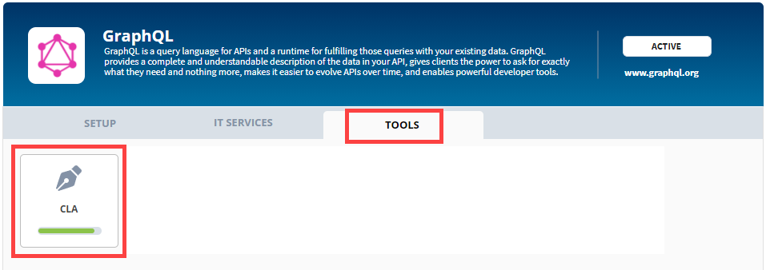
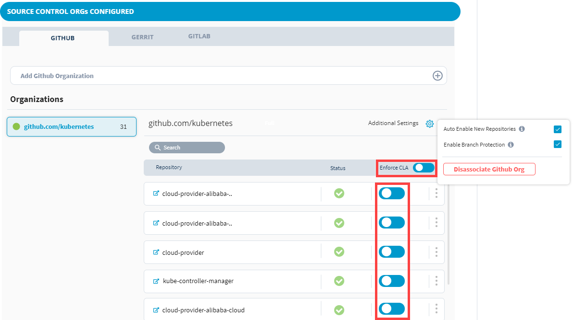
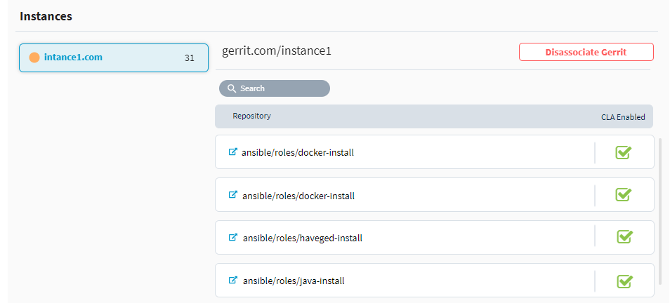

# Add or Remove Git Repositories for CLA Monitoring

Before you enable GitHub repositories for CLA monitoring or remove them from CLA monitoring, you must add the Git organizations— [add GitHub organization](./#add-github-organization) or [add Gerrit organization](./#add-gerrit-organization). You can perform the following activities with EasyCLA:

1. [Sign in](../sign-in-to-project-control-center.md).

2.Click a **project** of interest.

3. Navigate to **Tools** tab, and click **CLA**.

3. Select the CLA group to which you have added the project.

4. Click **Manage** next to the project for which you want to manage repositories.  
Source Control configuration page appears.

* [Configure GitHub Repositories](add-or-remove-git-repositories-for-cla-monitoring.md#configure-github-repositories)
* [Configure Gerrit Repositories](add-or-remove-git-repositories-for-cla-monitoring.md#configure-gerrit-repositories)

### Configure GitHub Repositories

1. Under GitHub, select the connected/added organization for which you want to manage repositories.

2. Select or deselect the check box next to a repository to enforce or remove from CLA monitoring for the repository .

3. Turn on or Turn off the **Enforce CLA** toggle key to enforce or remove all the repositories from CLA monitoring at a time.

### Configure Gerrit Repositories

After you[ add a Gerrit organization](./#add-gerrit-organization), by default all its repositories are CLA enabled. You cannot disable CLA for an individual gerrit repository. However, you can [disassociate gerrit organization](./#disassociate-gerrit-organization) to disable CLA for the organization and all its repositories.

