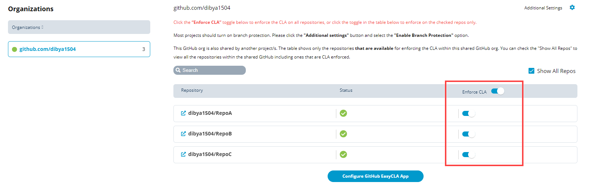

# Enforce or Remove CLA Mechanism

Before you enable GitHub repositories for CLA check or remove them from CLA mechanism, you must add the Git organizations— [add GitHub organization](./#add-github-organization) or [add Gerrit organization](./#add-gerrit-organization). You can perform the following activities with EasyCLA:

1. [Sign in](../sign-in-to-project-control-center.md) to the [Project Control Center](https://projectadmin.lfx.linuxfoundation.org/).
2. Click a **project** of interest.
3. Scroll down to **Tools Status** section, and click **EasyCLA**.

4. Select the CLA group to which you have added the project.

5. Click **Manage** next to the project for which you want to manage repositories.

* [Enforce CLA Mechanism for GitHub Repositories](enforce-or-remove-cla-mechanism.md#enforce-or-remove-cla-mechanism-from-github-repositories)
* [Enforce CLA Mechanism for Gerrit Repositories](enforce-or-remove-cla-mechanism.md#enforce-cla-mechanism-for-gerrit-repositories)

## Enforce or Remove CLA Mechanism from GitHub Repositories

1. Under GitHub, select the added organization for which you want to manage repositories.
2. Turn on or turn off the **Enforce CLA** toggle key to enforce or remove all the repositories from CLA monitoring at a time.
3. To enforce CLA for individual repositories, select the check box next to a repository, and click **Save**.

## Enforce CLA Mechanism for Gerrit Repositories

After you[ add a Gerrit organization](./#add-gerrit-organization), by default all of its repositories are CLA enabled. You cannot disable CLA for an individual Gerrit repository. However, you can [disassociate the Gerrit organization](./#disassociate-gerrit-organization) to disable CLA for the organization and all of its repositories.

