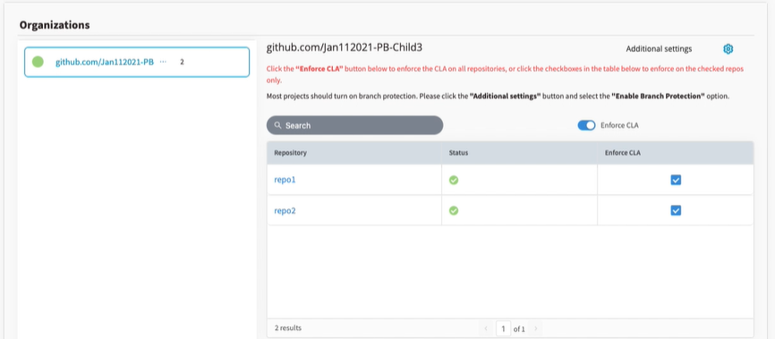

# View Connection Status of Git Organizations and Repositories

After you [add a GitHub](./#add-github-organization) or [Gerrit organization](./#add-gerrit-organization), the organizations are displayed with different colors referring to their connection statuses. Following is an example:

*  indicates full connection—all the repositories of the organization are connected.
*  indicates partial connection—some repositories of the organization are connected.
*  indicates no connection—the organization is added, but is not [configured](add-or-remove-git-repositories-for-cla-monitoring.md#configure-github-repositories) for CLA monitoring. 
*  indicates connection failure—for a connected organization, either the CLA configuration is uninstalled or the organization is deleted from GitHub.

A repository with a cross mark next to it indicates connection failure. It means the repository was CLA enabled, but it is deleted from the organization.

