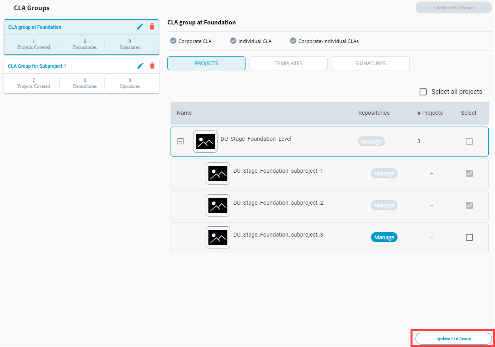

# Add or Remove a Project from CLA Group

You can add new projects to a CLA group or remove projects from a CLA group.

1. [Sign in](sign-in-to-project-control-center.md).

2. Under My Projects, click a project, and navigate to **Tools &gt; CLA**.

2. Under CLA Groups, select a CLA group for which you want to manage projects.

3.  Select or deselect the checkbox next to a project to add or remove the project from the CLA group.  
**Note:** A project's checkbox is selected and unavailable under a CLA group if the project is added to another CLA group.

4. Click **Update CLA Group**.

