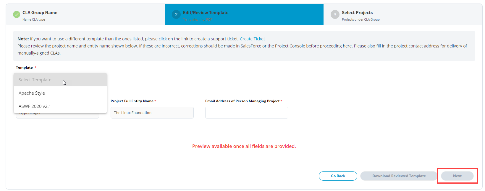
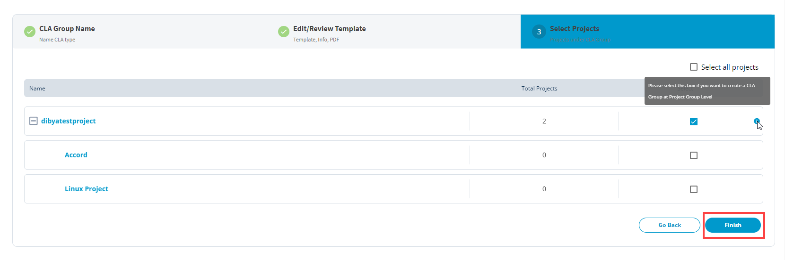

# Create New CLA Group

A CLA Group defines:

* What CLA types your project requires for pull requests or push submissions — corporate CLA (CCLA), individual CLA (ICLA), or both
* What CLA templates are used for the CCLA and/or ICLA
* What GitHub repositories, Gerrit instances, or both are enforced for CLA mechanism

A single CLA Group includes a pair of CCLA and ICLA templates, if both types are enabled for that CLA Group.

## To Create a project's CLA Group:

1. [Sign in](sign-in-to-project-control-center.md) to the [Project Control Center](https://projectadmin.lfx.linuxfoundation.org).
2. Under **My Projects**, click a project or search the project from the search bar for which you want to create a CLA group.
3. On the home page, scroll down to **Tools Status** section, and click **EasyCLA**.

4\. Click **+Add New CLA Group**.\
**Note:** For the current v2 release, a single project can have only one CLA Group. If you have already created a CLA Group for that project, _or for a parent of that project_, the **+Add New CLA Group** button will be disabled and you will not be able to create another CLA group for that project

.png>)

5\. Under **CLA Group Name** tab, provide a CLA group name and a brief description in the respective fields.  

**Note:** Click the help icons (**?**) to know more about a field or check box.

.png>)

6\. Select the check boxes as applicable to the contributors of a project, and click **Next**.


* A warning message appears if you select only one. Most projects will enable contributions under a CCLA as well as an ICLA.
* If you only select **Corporate CLA**, then only corporate employees can sign and contribute to your project.
* If you only select **Individual CLA**, then only individuals can sign and contribute to your project.


7\. Under **Edit/Review Template** tab,  review the project name, project full entity name. If these are not correct, _stop and do not proceed_. Check the Project object database settings and contact the LF legal team at legal@linuxfoundation.org if you have questions.

8\. Then, select a template from **Template** drop-down.** **and provide appropriate point of contact in the **Email Address of Person Managing Project** field. This will be filled into the CLA templates as the email address for contributors to submit signed CLAs if they want to sign them manually, rather than via DocuSign.


**Note:**

* If you want to use a different template than the ones listed, [create a support ticket](https://jira.linuxfoundation.org/plugins/servlet/theme/portal/4/create/143) with the correct CCLA and ICLA templates that your project will use.
* Both the available templates are standard CCLA / ICLA pairs that are used by several projects on EasyCLA. These templates are derived from the Apache Software Foundation's CLAs and Academy Software Foundation's CLAs, but are _not_ identical to either of them.


9\. Review the generated CCLA and ICLA templates. If the filled-in values or other contents of the template do not look correct, _stop and do not proceed_. Contact the EasyCLA support team by [filing a support ticket](https://jira.linuxfoundation.org/plugins/servlet/theme/portal/4/create/143) if you need assistance.

10\. If the Project for which you are creating the CLA Group has no subprojects, then click **Finish** and skip the next step.

11\. If the Project for which you are creating the CLA Group _does_ have subprojects, then click **Next**. Under the **Select Projects** tab, select the projects that you want to enroll under the CLA group, and click **Finish**.


**Note: **As mentioned above, for the initial v2 release, a single project can only have one CLA Group. If you have already created a CLA Group for that project, _or for a parent of that project_, the **+Add New CLA Group** button will be disabled and you will not be able to create another CLA group for that project.


