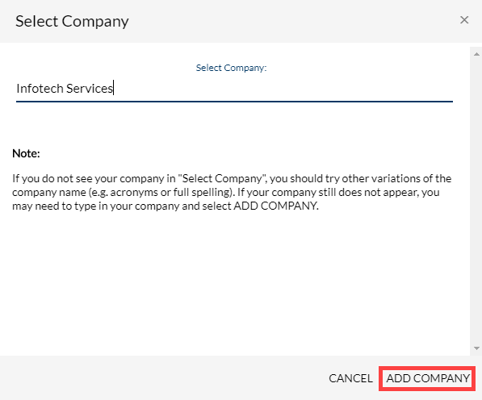

# Add a Company to a Project


**Note:** If you are also the project manager, make sure that you are logged out of the CLA Management Console before you begin using the CLA Corporate Console.


**To Add a Company:**

1. ​[Sign in](sign-in-to-the-easycla-corporate-console.md) to the [CLA corporate console](https://easycla.lfx.linuxfoundation.org/#/).
2. Click **GET STARTED**.\
   &#x20;&#x20;
3. Type a company's name in the dialog fields and click **ADD COMPANY.**\
   **** ​​ 
4. Sign out or continue to [Sign a Corporate CLA for Company](sign-a-corporate-cla-for-company.md).

