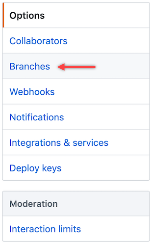

# EasyCLA is Disabled

EasyCLA is disabled hence the GitHub organization(s) that I want EasyCLA to monitor are not monitored.

**Solution:**

#### **Enable Branch Protection**

GitHub is set up to permit administrators and organization owners to have maximum flexibility, which includes disabling installed applications, such as EasyCLA. To avoid this, you must enable branch protection by selecting the **Enable Branch Protection** check box after the GitHub organization is added to a project or add the branch protection rule manually, as described below:

**Do these steps:**

1\. As the GitHub organization owner or administrator, go to the GitHub repository that you want EasyCLA to monitor.

2\. Click **Settings** from the top menu.

3\. Settings appear with Options in the left pane.

4\. Click **Branches** under Options.

**Result:** Branch settings appears.

5\. Select **master** for the Default branch. Click **Edit** or **Add rule** for Branch protection rules of your organization.

**Result:** Branch protection rule settings appears

6\. Select the following check boxes in Rule settings and click **Create**.

* Require status checks to pass before merging
* Require branches to be up to date before merging
* Include administrators

