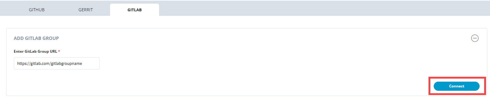
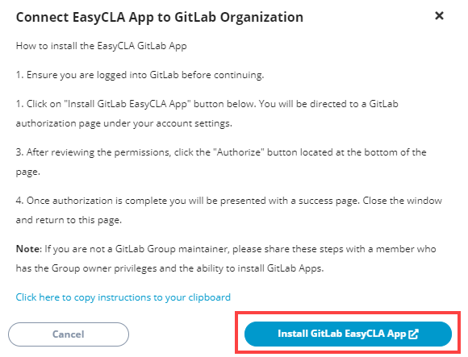
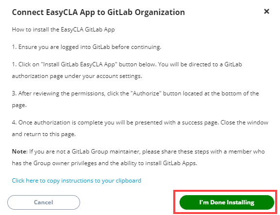
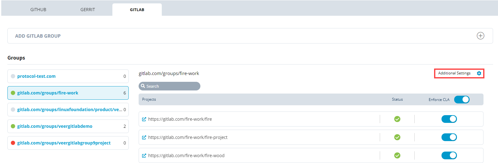
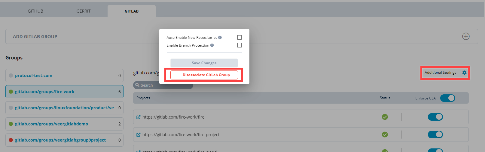

# Add and Manage GitLab Groups

Before you can add or manage GitLab groups and projects, you must connect or add GitLab groups while setting up IT services. However, you can also add GitLab groups in the GitLab pane of **Tools** tab.


**Note**:

* In GitLab, _organizations_ are mentioned as _groups_, and _repositories_ are mentioned as _projects_.
* You must be the owner of the GitLab group which you want to connect for CLA mechanism.


* ​[Add GitLab Groups](add-and-manage-gitlab-groups.md#add-gitlab-groups)​
* ​[Enable Branch Protection and Auto Enable New Repositories](add-and-manage-gitlab-groups.md#enable-branch-protection-and-auto-enable-new-repositories)​
* ​D[isassociate GitLab Groups](add-and-manage-gitlab-groups.md#disassociate-gitlab-groups)​

After you successfully add Git organizations, you can:

* [​View Connection Status of Git Organization and Repositories](view-connection-status-of-git-organizations-and-repositories.md)​
* ​[Enforce or Remove CLA Mechanism from GitLab Projects​](enforce-or-remove-cla-mechanism.md#enforce-or-remove-cla-mechanism-from-gitlab-projects)

## Add GitLab Groups 

1\. Sign in to the [Project Control Center](https://projectadmin.lfx.linuxfoundation.org).

2\. Click a **project** of interest.

3\. Scroll down to the **Tools** **Status** section, and click **EasyCLA**.

**Note:** You can also connect the GitLab groups during IT setup in the IT Services Status section, and then install the EasyCLA application in the Tools Status section to add it for the CLA process.

4\. Under CLA Groups, select a CLA group to which you have added the project.

5\. Click **Manage** next to the project for which you want to manage repositories.

6\. Under the GITLAB tab, click the **+** sign at the top right of ADD GITLAB GROUP.

7\. Provide the complete URL of the GitLab group, as shown in the image, in the **Enter GitLab Group URL** field, and click **Connect**.

8\. Click **Install GitLab EasyCLA App**.

9\. Click **Authorize**.

10\. Installation Successful window appears. Close the window, navigate to the Project Control Center, and click **I'm Done Installing**.

**Note:** If you do not click **I'm Done Installing**, you will have to reinstall EasyCLA application.


**Note:**

1.LFX EasyCLA adds all the projects, including projects under subgroups, of the GitLab group to the Project Control Center.

2.To enable a CLA mechanism on a project, you must [enforce CLA mechanism](enforce-or-remove-cla-mechanism.md#enforce-or-remove-cla-mechanism-from-gitlab-projects) for GitLab projects. Simply adding a GitLab group to the project does not enable the EasyCLA mechanism for any GitLab project.

3.To review the configuration or revoke the application, navigate to the _GitLab Applications under your User Settings_.


## Enable Branch Protection and Auto Enable New Repositories 

After adding the GitLab group, you should enable branch protection and auto enable new repositories.

* **Enable Branch Protection** automatically enables the EasyCLA check for all the branches of the GitLab group. If you select this check box, you do not need to [enable branch protection manually](../getting-started/easycla-troubleshooting/easycla-disabled.md#enable-branch-protection).
* **Auto Enable New Repositories** automatically adds a repository under the GitLab group on the project console when you add a project to the GitLab group.

**To enable branch protection and auto enable new repositories:**

1\. Click the settings icon next to **Additional Settings** for a GitLab group.

2\. Click both the check boxes, and click **Save Changes**.

## Disassociate GitLab Groups 

**Note**: To disassociate a GitLab group, you must disable CLA from all projects of the GitLab group.

1. Click the settings icon next to **Additional Settings** for a GitLab group.
2. Click **Disassociate GitLab Group**, and click **Disassociate** on the confirmation window.

