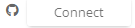

# Connect Using GitHub

## Connect to GitHub

You can connect to Github Account from your CommunityBridge account.

1. On the Account Settings page, click **Connect**  next to the GitHub symbol.
2. You are navigated to the Github login page. Enter your username and password.
3. The Connect button changes to green color confirming the successful connection. 

   The text on the button changes to _Connected_.

## To Disconnect your GitHub Account

1. When you move your mouse over the green _Connected_ button, 

   you are provided with an option to _disconnect_ from your GitHub account. The text changes to _Disconnect_. 

   

2. Click **Disconnect**. On the Confirm Social Disconnection window, 

   click **Yes** to confirm your disconnection. You are now disconnected from your GitHub account.

More on Managing your profile [here](account-settings.md).

