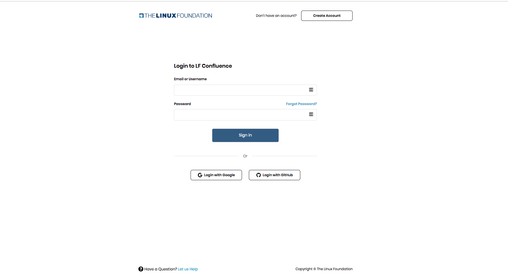
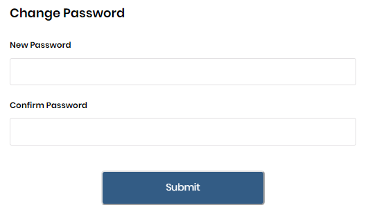

# Login or Sinup

* [Create an account](login_signup.md#create-an-account)
  * [Verify email](login_signup.md#verify-email)
* [Login with Linux Foundation ID](login_signup.md#Login-with-Linux-Foundation-ID)
* [Forgot password](login_signup.md#Forgot-password)
* [Login with Google](login_signup.md#Login-with-Google)
* [Login with GitHub](login_signup.md#Login-with-GitHub)
* [Get Help](login_signup.md#Get-Help)

## Create an account

If this is the first time you are logging in to Linux Foundation, you need to first create an account. To create a Linux Foundation account, do the following:

1. Go to [Linux Foundation Confluence website.](https://confluence.linuxfoundation.org/)
2. Click **Create Account**. 
3. On the Create a Linux Foundation Account page, enter your email address, Username, First name, Last name, and Password.

   _**NOTE:**_ 

   

4. Click **Create Account**. You are directed to the Verify your account page. If you did not receive an email, click **Resend Email**.

   

[Top of page](login_signup.md#Log-in-or-Sign-up)

### **Verify Email**

When you create a new account, an account verification email is sent to your registered email address. To verify your account, do the following:

1. Open your registered email account and open the verification email. An example of the email is as follows:

1. Click **Verify Email**. A confirmation message that the email has been verified is displayed.

You are directed to Login page.

[Top of page](login_signup.md#Log-in-or-Sign-up)

## **Login with Linux Foundation ID**

After you have created a new account and verified the account, you can now log in using your Linux Foundation ID/Email. To log in to your Linux Foundation's account, do the following:

1. Go to [Linux Foundation Confluence website.](https://confluence.linuxfoundation.org/).
2. Enter your Linux Foundation Email/Username and Password, and click **Sign in**.

. You are now logged in to Linux Foundation.

[Top of page](login_signup.md#Log-in-or-Sign-up)

## **Forgot password**

If you do not remember your Linux Foundation login password, you can submit a password reset request. The request sends an email to your registered email address and from that email, you can set a new password. To reset your password, do the following:

1. Go to [Linux Foundation Confluence website.](https://confluence.linuxfoundation.org/)
2. On the Sign In page, click **Forgot Password?**. The ”Forgot your Password?” page appears.

   

3. Enter your Email/Username and click **Reset Password**. A confirmation message informs you:

    If you did not receive an email, click **Did not Receive Link** in the ”Forgot your Password?” pane to resend the email.

4. Open the Reset Password email from your registered email account.

   

5. Click **Reset Password** in the email. On the Change Password page, enter New Password and Confirm Password, and click **Submit**. Your password is reset.

   

   _**NOTE:**_ The New Password and Confirm Password should be exactly identical. You can reset your password either via Linux Foundation Email or Username.

[Top of page](login_signup.md#Log-in-or-Sign-up)

## **Login with Google**

Social login is a single sign-on for end users. You can use your existing login credentials from Google to log in to the Linux Foundations rather than creating a new Linux Foundations account. During your initial login, you enter your Google credentials to authenticate your Google account. Subsequent logins do not require you to enter your credentials⏤you simply click **Login with Google**.

#### Initial login:

1. Go to [Linux Foundation Confluence website.](https://confluence.linuxfoundation.org/)
2. On the login screen, click **Login with Google** .
3. Enter your Google email or phone number and click **Next**.
4. Enter your password, and click **Next**.
5. Enter the Username, and click **Create account**.

#### Subsequent login:

Subsequent logins do not require you to enter your credentials. You can click **Login with Google** option. This one-click approach simplifies your logins.

[Top of page](login_signup.md#Log-in-or-Sign-up)

## **Login with GitHub**

You can use your existing login credentials from GitHub \(social network provider\) to log in to Linux Foundations rather than creating a Linux Foundations account. During your initial login, you enter your GitHub credentials to authenticate your GitHub account. Subsequent logins do not require you to enter your credentials⏤you simply click **Login with GitHub**. This one-click approach simplifies your logins.

#### Initial login:

1. Go to [Linux Foundation Confluence website.](https://confluence.linuxfoundation.org/)
2. On the Login page, click **Login with GitHub** .
3. On the GitHub Sign page, enter Username or Email address and password.

   

4. Click **Sign-in**.
5. Enter the Username, and click **Create account**.

#### Subsequent login:

Subsequent logins do not require you to enter your credentials. You can click **Login with GitHub** option. This one-click approach simplifies your logins.

[Top of page](login_signup.md#Log-in-or-Sign-up)

## Get Help

If you encounter any problem while doing a task, for example, Login, Create Account, and you do not get the expected outcome, you are directed to the Get Help page. You can describe the nature of your problem and request help from the Support team.

To submit your help request do the following:

1. Click **Get Help** on the Linux Foundation Get Help page.
2. On the Request Support page, enter your name, registered email address and the description of your problem. Click **Send**.

   

A request is submitted to the Support team.

[Top of page](login_signup.md#Log-in-or-Sign-up)

