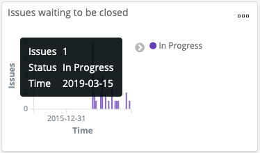
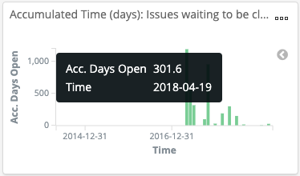

# Understand the Jira Backlog


Roles: Developer, Project Manager

Where: Jira dashboards are available from the **Issue Management** drop-down list.


You are interested in participating in a project, but first, you want to see if the project has an accumulation of uncompleted work that needs to be dealt with in the backlog.

**Do these steps:**

1. Click a **project name** on a project of interest that shows the Jira logo  (3) (3).png>).
2. From the **Issue Management** drop-down list, select **Jira** > **Backlog**.\
   A dashboard focuses on open issues, their accumulated time, and associated organization. For details, see [Jira > Backlog](../technical-metrics/project-management/jira.md#backlog).
3. View statistics about open issues in **Open Issues Statistics**. These statistics give you a summary of open issues in the backlog.
4. Look at the data in **Issues waiting to be closed** and **Accumulated Time (days): Issues waiting to be closed** to learn about the number of issues by status over time.\
   \
   
5. Find more information in the dashboard such as who the submitters are and the average days open of the issues that they submit. For example, you might notice a recurring pattern of issues that accumulate in a certain time frame.

This data can help you decide if this is a project in which you want to spend your time.
