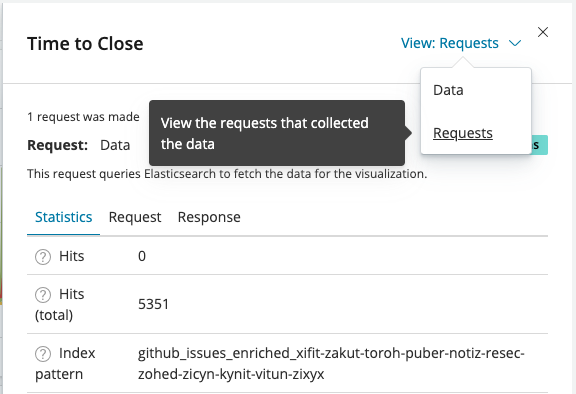

# Inspect the Data

You can use the Inspect option to learn more about the data.

1. Mouse over a visualization, and click ****\
   ****The Options dialog appears.\
   &#x20;&#x20;
2. Select **Inspect**.\
   A dialog appears with options.
3. Select an option: **Data** or **Requests**.\
   **Data** shows a table and lets you download the table data to a CSV file.\
   **Requests** shows the Statistics, Request, or Response for the data in tabs.\
   \
   
