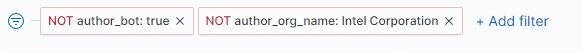

# Use Visualization Options

Useful options let you perform actions on a visualization, such as exporting data from a table. Visualizations provide an option where appropriate.

1\. Open a dashboard and then go to a visualization of interest.

2\. For a doughnut chart visualization, click a value or organization as shown below, and then click  to view data specifically for the selected value or  to remove its data for a dashboard.

Following example shows data specifically for a selected organization:&#x20;

Following example shows dashboard where an organization's data is removed/filtered.

3\. Click a common **icon** or **item** as available to:

| Icon                                    | Description                                                                                                                                                                                                                                                                                                                                                                                                                                                                                                                                                                                                                                                                                                                                                                                                                                                                                                                                                                                                                                                       |
| --------------------------------------- | ----------------------------------------------------------------------------------------------------------------------------------------------------------------------------------------------------------------------------------------------------------------------------------------------------------------------------------------------------------------------------------------------------------------------------------------------------------------------------------------------------------------------------------------------------------------------------------------------------------------------------------------------------------------------------------------------------------------------------------------------------------------------------------------------------------------------------------------------------------------------------------------------------------------------------------------------------------------------------------------------------------------------------------------------------------------- |
|  | 
Options:
<ol><li><strong>Inspect</strong>: Inspects data for the visualization.</li><li><strong>Customize time range</strong>: Lets you select a time range and add it to the panel. Click <strong>Show dates </strong>and the time range to open the time range picker for the visualization. Relative lets you enter the relative start time. You can specify the relative start time as any number of seconds, minutes, hours, days, months, or years ago. You can click the <strong>Round to the &#x3C;time> </strong>key to set the exact time. After you click <strong>Add to panel</strong>, the timeline is added to the visualization panel, as shown below.</li></ol>
  

<strong>Full screen</strong>: Expands a visualization to full screen.
 |
|  | Toggles the list view                                                                                                                                                                                                                                                                                                                                                                                                                                                                                                                                                                                                                                                                                                                                                                                                                                                                                                                                                                                                                                             |
|  | Show and hide a legend.                                                                                                                                                                                                                                                                                                                                                                                                                                                                                                                                                                                                                                                                                                                                                                                                                                                                                                                                                                                                                                           |
|  | Sort the column data in ascending or descending order.                                                                                                                                                                                                                                                                                                                                                                                                                                                                                                                                                                                                                                                                                                                                                                                                                                                                                                                                                                                                            |
|  | 
Export and download data to a Comma-Separated Values (CSV) file.
<ul><li><strong>Raw</strong> downloads the data as provided: dates are timestamps, numbers do not have a thousand separator, and so on.</li><li><strong>Formatted</strong> downloads the data in table format.</li></ul>                                                                                                                                                                                                                                                                                                                                                                                                                                                                                                                                                                                                                                                                                                                                                                   |
|  | Open the corresponding URL.                                                                                                                                                                                                                                                                                                                                                                                                                                                                                                                                                                                                                                                                                                                                                                                                                                                                                                                                                                                                                                       |
