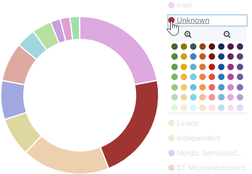

# Change the Data Marker Color

A data marker represents a single data value on bar graphs, stacked bar graphs, doughnut charts, and so on. You can change the color of a data marker to meet your needs.

**Do these steps:**

1. On a chart legend, click the **color** of the individual data marker that you want to change. A color chart appears: 
2. Click the **color** you want to use. The data marker refreshes to show the color that you chose.

