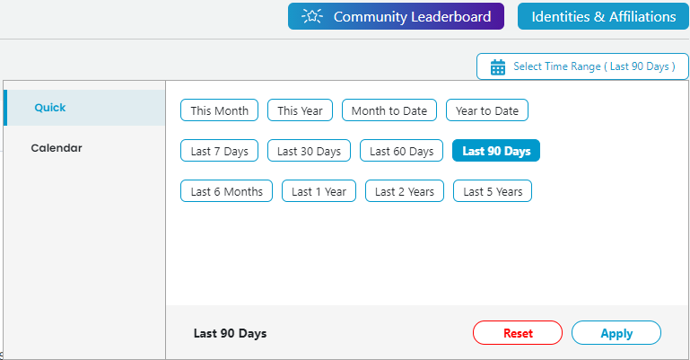

# Select Time Range

You can pick a time range to apply to all the data in an overview or dashboard. By default, the time range value is set to last 90 days.

**Follow these steps:**

1. Open a project dashboard and click **Select Time Range**.  
    The Time Range picker opens. Default time range is **Last 90 days**.

2. Select a quick filter to apply a time range and a value:

* **Quick** shows preset time range values. Select a value, such as This Month, This Year, and so on, and click **Apply**.
* Clicking **Reset** changes the time range to default value–last 90 Days.
* **Calendar** lets you enter the start date and end date in the MM-DD-YY, HH:MM:SS format. Click **Apply** to see the project summary for the selected date and time.

The data refreshes to match your time range selection, and the value you selected shows next to Time Range.

