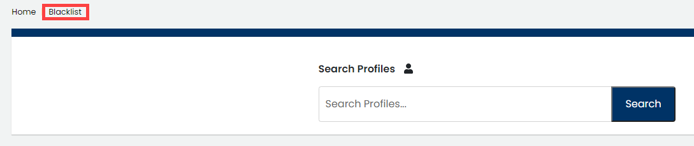

# Blacklist an Email Address

A blacklist prevents an email address from being merged with other identities.

**To Blacklist an Email Address:**

 1. Select a **project name** of interest.

2. Click **Identities &** **Affiliations**.

3. Select **Blacklist** from the menu.

4. \(Optional\) Enter an email address in the Search by email field and click **Search**.  
Email results list matches.

5. In the New blacklist email field, enter the **email address** that you want to add, and click **Add**.

6. Click **Ok** on the Success confirmation dialog that appears.  
The Email blacklist shows the added email address.

## Delete an Email Address From the Blacklist 

You can delete an email address from the Blacklist. This action means that this email address can be merged with other identities.

1. From Blacklist menu, click **Delete** on the row of the email address that you want to delete from the blacklist.
2. Click **Delete** on the Confirm dialog that appears.
3. Click **Ok** on the Success confirmation dialog that appears.

