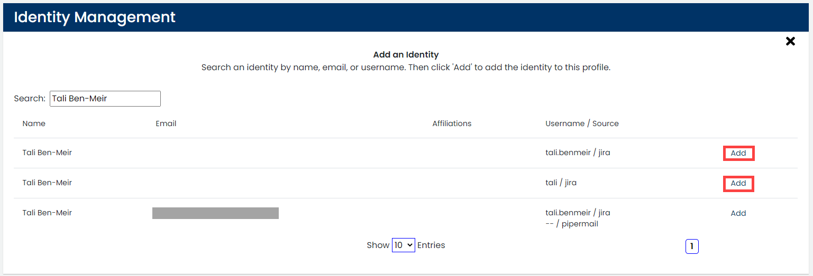

# Merge or Unmerge an Identity Profile

An identity is a record (tuple) composed of a name, email, username, and the name of the source from where it was extracted. Records are converted to unique identifiers.

Each unique identity has a profile that summarizes the user data. The profile can be linked to more than one identity and you can merge an identity to the profile.


**Important: **

* LF Insights automatically merges a new identity to an existing profile if the new identity has the same email address and name that of the existing profile in the relational database.
* LF Insights supports names with special characters while checking for an identity:
  * Single Apostrophe (')
  * Double Apostrophe (")
  * Dejan Mijić
  * Ján Srni?ek, and so on


**To Manage an Identity:**

1. Select a **project name** of interest.
2. Click **Identities & Affiliations**.
3. Select a profile from **Top Unaffiliated Contributor **list or [search for a profile](find-a-profile.md).
4. Click a **row** that corresponds to a name of interest.
5. Navigate to **Identity Management**.\
   The profile identities are listed. Each identity shows Name, E-mail, Username, Source, and an Unmerge button.\
   **Note: Unmerge** CTA button is not displayed:
   * If there is only one identity associated with the profile
   * for the unique profile to which identities are merged
6. Continue to merge or unmerge an identity profile:
   * [Merge an Identity Profile](merge-or-unmerge-an-identity-profile.md#merge-an-identity-profile)
   * [Unmerge an Identity Profile](merge-or-unmerge-an-identity-profile.md#unmerge-an-identity-profile)

## Merge an Identity Profile

An identity relates a profile with a unique identity.

1\. Click** Add New**.\
The Add an Identity pane appears:

2\. Type a name or email in the **Search** field, and press **Enter**.\
Matching results appear.

3\. Find the unaffiliated identity (Affiliations is blank) that you want to add, and click **Add** on the row.

4\. Click **X** to close the window.\
The added identity is listed in Profile Identities.

## Unmerge an Identity Profile

After you add a unique identity to a profile, the identity appears under Identity Management .

Click **Unmerge**, and confirm** **to unmerge the unique identity from the user profile.

