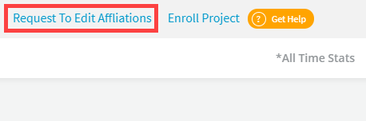

# Request Access to Affiliation Management

Affiliation Management becomes enable for you after you request and, are granted access to your specific projects.

**Prerequisites:  **You must have a Single Sign-On (SSO) account. [Create an account](../../sso/create-an-account.md) if you do not have an SSO account.

1\. Sign in to [LFX Insights](https://insights.lfx.linuxfoundation.org/projects), and navigate to a project group or individual project dashboard.

2\. From the navigation bar, click **Request To Edit Affiliations**.

3\. Provide details in the form that appears.

4\. Click **Create**.

You are notified when you are granted access. After you are granted access, use your SSO account credentials to sign in and, search and manage contributors' affiliations.
