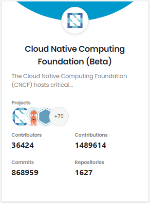

# Overview

Insights platform shows Trends dashboard, and project and project group cards, in alphabetical order, that show relevant data associated with the project or project group. Navigate to a project or project-group to see the overall project activities.

1. Go to [https://insights.lfx.linuxfoundation.org/](https://insights.lfx.linuxfoundation.org).
2. [**Global Trends**](trends.md#global-trends): Shows overall project performance for all project-groups and projects.
3. **View All Projects**: Lists all the [projects](overview.md#project) onboarded to LFX Insights. [Project group](overview.md#project-group) card displays stack of individual projects..
4. [**Compare Projects**](compare-and-view-project-health.md): Lets you compare key code related metrics for a project or between projects.
5. **Search projects** field: Lets you search a project or project group.
6. **Enroll Project**: Lets you enroll a project into LFX Insights by creating a support ticket on [LFX Help Center](https://jira.linuxfoundation.org/plugins/servlet/theme/portal/4/create/341).
7. **Get Help**: Click **Doc** to navigate to the Insights user documentation page, and **Support** to create a support ticket on LFX if you face any issues with LFX Insights.
8. While navigating from top to bottom on dashboards, click  from the down right corner to reach to the top of the page.

### Project

A project is a standalone project maintained by The Linux Foundation. Under **View All Projects**, click the project name or **Go to Overview** to navigate to the project dashboard.

Each project card shows the following information:

* Project name identifies the project by name.
* Description briefly describes the project. Click the **excerpt** to see the entire description.
* **Contributors** shows the total number of contributors to the project.
* **Contributions** shows the total number of lines of codes that are changed in the project. It includes lines of code added, modified, and deleted.
* **Commits** shows the total number of commits to the project.
* **Repositories** shows the total number of repositories created for the project.
* **Lines of Code** shows total number of lines of code added and modified for the project repository.
* **Data Sources** shows the logos of different data sources, such as  (3) (1) (1) (2).png>) for GitHub and/or Gerrit,  (3) (3) (3) (1) (1) (1).png>) for Jira, or  (2) (2) (2) (1) (1) (1).png>) for Slack, and so on.

### Project Group

A project group is a group of individual projects. Click the name or click **Go to Projects** to see the trends dashboard and sub-projects under the project group. For details, see Project Group. To view the sub projects of a project group, and navigate to a sub project, click **View Sub Projects** from the top right corner to view the list of sub projects.

Each card shows the following information:

* Name of the project group.
* Description briefly describes the project group. Click the **excerpt** to see full description.
* **Contributors** shows the total number of contributors to the project.
* **Contributions** shows the total number of lines of codes that are changed in the project. It includes lines of code added, modified, and deleted.
* **Lines of Code** shows total number of lines of code added and modified for the project repositories.
* **Projects** shows the logos of sub-projects under the project group.

On a project dashboard, click **Get Short URL**, and click the icon next to the URL to copy the link of a respective dashboard for a project.\
.png>)

## **Insights Features**

* [View Community Leader board](community-leader-board/)
* [View Identities and Affiliations](identities-and-affiliations/): Displayed to only Administrators after they sign in to Insights.
* [Compare and view Project Health](compare-and-view-project-health.md)
* [Filter Data](filter-data/)
