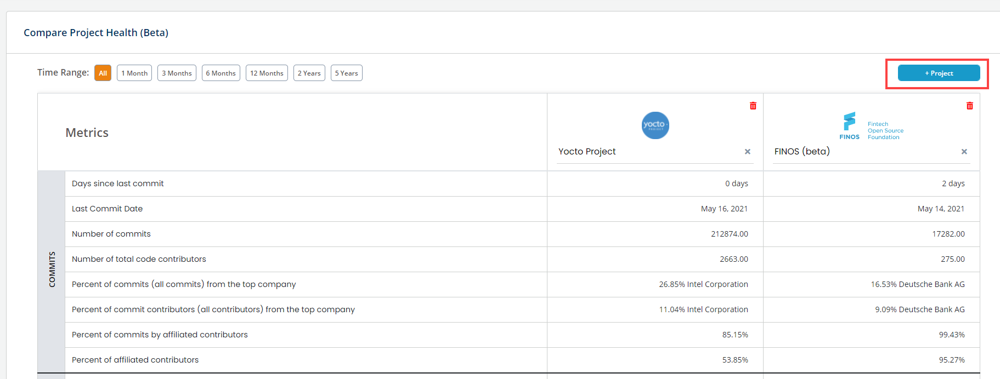

# Compare and View Project Health

Project Health Dashboard is a tool that lets you compare key code related metrics for a project or between projects \(at the most you can compare 10 projects side-by-side\). These metrics come from a variety of data sources that can be broadly categorized into Version Control System and Issue Management System, and include supported systems, such as Git, Github, Gerrit, Jira and Bugzilla.

The dashboard serves two purposes:

1. Comparing the key metrics for the same project for different time periods.
2. Comparing the key metrics between multiple projects for the selected time period.


**Note:** For better comparing of metrics between projects, compare projects that have the same data sources as version control or issue management systems. If you compare projects that use different data sources, the side-by-side comparison will not be available, and metrics will show separately. For example if you compare between Onap and Yocto, Onap uses Jira and Yocto uses Bugzilla as issue management systems, the comparison of these two metrics will not be displayed side-by-side, rather will show separately.


**To View Project Health Dashboard:**

 1. Go to[ https://insights.lfx.linuxfoundation.org/](https://insights.lfx.linuxfoundation.org/)

2. From the top left corner, click Compare Project Health.

3. Type and select a project in the **Search Projects** field.

4. Click **+Project** to add a new field to select and compare projects.   
**Note:** Default time range is “All”. Select a time range from the available options to change the metrics for the time period.

5. Following are the list of statistics displayed for different data sources:

1. **Commits**: Commits show git commit status, such as last commit date, total number of commits, total number of contributors, percentage of commits from top organizations including the affiliated contributors, and so on. If you select a time range, up and down arrows for a metrics shows if the contributions have increased or decreased in that time period. Percentage of affiliated contributors and contributions shows contributions from those contributors who are affiliated with an organization, meaning the contributions are not from "Unknown" contributors.
2. **Pull Requests**: Pull Requests show total number of open, closed, and merged PRs, total number of PRs rejected, total number of contributors reviewing PRs, percentage of PRs merged from top organizations, and so on.
3. **Changesets**: Changesets show how many changesets are in open or closed states, changesets, percentage of changesets merged from top organizations, percentage of contributors merging the changesets, and so on.
4. **Jira/Bugzilla Issues**: Each section shows total number of issues, submitters, assignees, issues in open state, total number of reopened issues, total number of issues in closed state, complete state, percentage of issues submitted by top organizations, percentage of submitters from top organizations, and so on.

