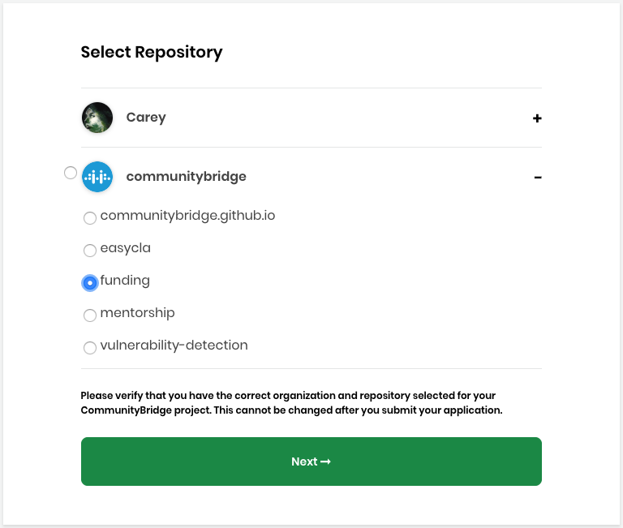

# Add a GitHub Project

As a project administrator, you can submit an application to Funding by adding a GitHub open source project. Linux Foundation requires access to your code repository to support security vulnerability scanning.


Keep these items ready before you begin:

* The project ID for your [Core Infrastructure Initiative \(CII\) Badge Program](https://www.coreinfrastructure.org/programs/badge-program/) 
* The URL for your code of conduct \(the rules of behavior for the members of that group or organization\)
* A logo file that represents your project in JPG, PNG, SVG format with a maximum size of 2 MB
* A list of names and email addresses of the individuals who will benefit from working on the project


### **To add a GitHub Project:**

1. [Sign in](../../../sso/sign-in/) to [CommunityBridge Funding](https://funding.communitybridge.org/).
2. Click Apply and select **ADD GITHUB PROJECT.**  
3. Enter your credentials and click **Sign in.**
4. Select **Authorize communityBridge** to grant CommunityBridge Funding read-only access to your GitHub account. The Select Repository popup appears that lets you link a repository to your project.   
5. Select the **repository** that you want to use and click **Next.** This step verifies that you have the correct organization and repository selected for your CommunityBridge Funding project. You cannot change your selection after you submit your application.
6. Complete the project application form; red asterisks indicate required fields. For information about fields, see [Project Application Form](../project-application.md).
7. Click **Submit Application.** The Linux Foundation administrator will approve or reject the application. The Linux Foundation sets up the financial aspects of your project and contributors, such as Expensify accounts and a project expense policy.
8. \(Optional\) Go to your user account and select **My Projects** to see your pending project.    **Note:** You can edit your project at any time. Select the project you want to update and click **Edit Project**.

