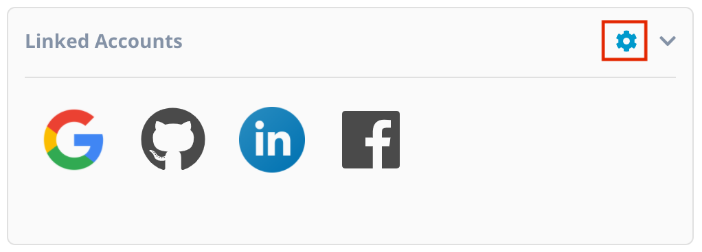
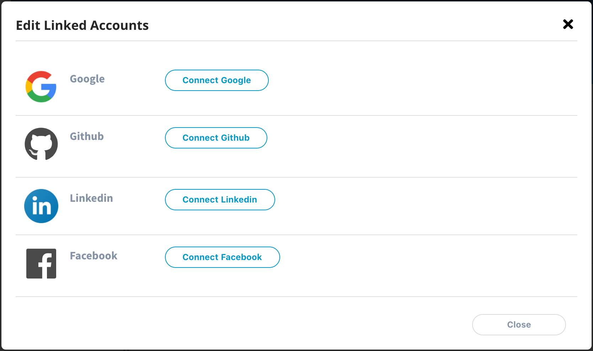
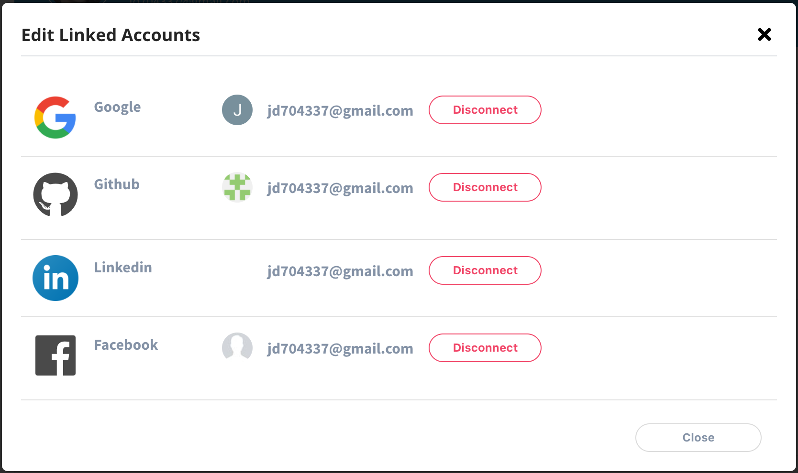

# Link Your Social Accounts

You can manage and link your social profile accounts like Google, Twitter, GitHub and LinkedIn to your Linux Foundation account. You can use Google, GitHub, LinkedIn and Facebook to sign in to the Linux Foundation account as well.

To manage and link your social profile accounts, follow these steps:

1. Navigate and login to [myprofile.linuxfoundation.org](https://myprofile.linuxfoundation.org/) and click on the settings icon  on the **Linked Accounts** section.

2.The **Edit Linked Accounts** modal appears with list of the social profile accounts that you can add. Click **Connect** CTA button available next to the social media Logo and name.

3.Once the account is linked, your email address associated with the account will appear. 


To remove the linked account, click **Disconnect** CTA button.


