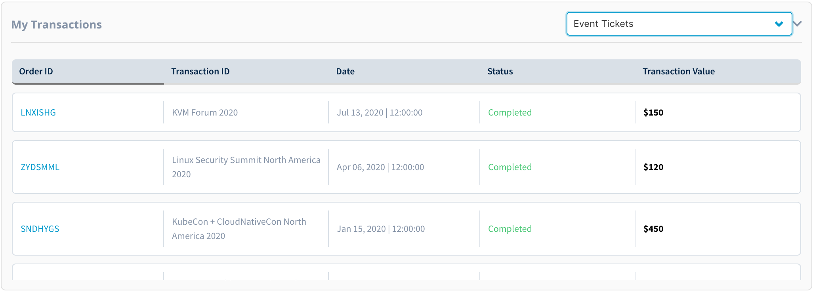

# View Transactions

To view your transactions for all the purchases you made through Linux Foundation, login to [myprofile.linuxfoundation.org](https://myprofile.linuxfoundation.org/) and scroll down to My Transactions section. In this section you can view the following transaction details: 

* Order ID number
* Transaction ID \(the name of the product, event, training or certification course\)
* Transaction date
* Transaction status
* Transaction value

Transactions can be filtered by the following three categories:

**Event Tickets** 

**Training and Certifications** 

**Linux Individual Supporter program and Linux.com** 

