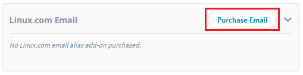
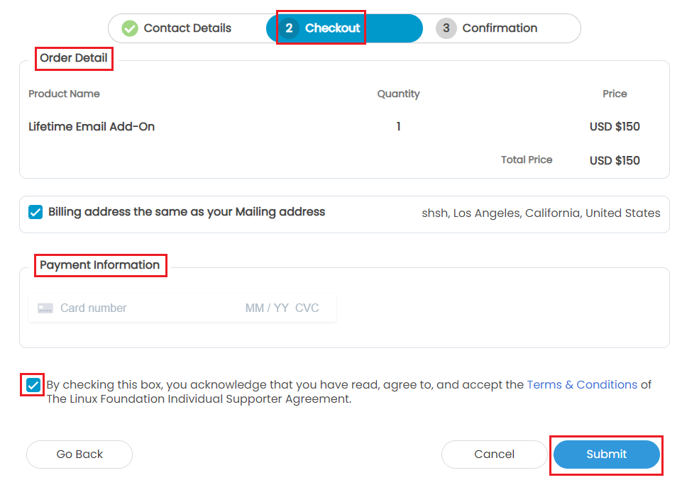

# Purchasing Lifetime Linux.com Email Alias

You can purchase Lifetime Linux.com email alias if you are an active Individual Supporter with a click on a CTA button in three different places: My Profile app, the order confirmation screen when you complete the Individual Supporter purchase, and the Individual Supporter purchase confirmation email.

For more information on the Individual Supporter program, please see [Individual Supporter](https://www.linuxfoundation.org/about/individual-supporters/) webpage.

You can purchase Linux.com Email Alias using the following options:

* [Purchase Linux.com email alias from My Profile app ](purchasing-linux-email-alias-for-lifetime.md#purchasing-through-my-profile-app)
* [Purchase Linux.com email alias from the Individual Supporter order confirmation screen](purchasing-linux-email-alias-for-lifetime.md#purchasing-through-order-confirmation)
* [Purchase Linux.com email alias from the Individual Supporter purchase confirmation email](purchasing-linux-email-alias-for-lifetime.md#purchasing-through-individual-supporter-purchase-confirmation-email)

### Purchasing through My Profile App

To purchase Linux.com email alias from My Profile app, follow these steps:

1. Login to [My Profile](https://myprofile.linuxfoundation.org/) and select Purchase Email CTA button on the **Linux.com Email** section.

2.If you are enrolled in the Individual Supporter program, you will be navigated to the Lifetime Linux.com Email Alias Add-On form, **Contact Details** page.

3. On the next **Checkout** page, you can view the **Order Detail** and price.  Please provide the billing address details if different from your mailing address, enter the credit card details under **Payment Information**, check the Terms and Conditions box, and click **Submit**. 

4.On the Confirmation page, you can view your **Order Number**, the link to My Profile app, and  Individual Support FAQ.

### Purchasing through Order Confirmation

When you complete the purchase order for Individual Supporter program, you will get a confirmation screen with the order details. You can also purchase Linux.com email alias from the Order Confirmation screen. 

To purchase Linux.com email alias from the order confirmation screen when you complete the Individual Supporter purchase, follow these steps:

1.After purchasing the Individual Supporter program, the Order Confirmation screen appears. Click the **Click to Purchase** button to purchase Linux.com email alias. 

2.You have to repeat Steps 2 to Step 4 from [Purchasing through My Profile App](purchasing-linux-email-alias-for-lifetime.md#purchasing-through-my-profile-app) to finish the purchase of Linux.com email alias. 

### Purchasing through Individual Supporter Purchase Confirmation Email

You will receive a confirmation email from Linux Foundation after purchasing the Individual Supporter program. You can also purchase Linux.com email alias from a link available in the email. 

To purchase Linux.com email alias from the Individual Supporter purchase confirmation email, follow the following steps:

1.After purchasing the Individual Supporter program, the Order Confirmation email will be sent to your registered email. Click **Get Email Add-On** button to purchase Linux.com email alias. 

2.You have to repeat Steps 2 to Step 4 from [Purchasing through My Profile App](purchasing-linux-email-alias-for-lifetime.md#purchasing-through-my-profile-app) to finish the purchase of Linux.com email alias.

