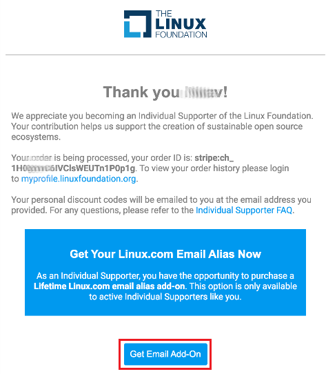

# Purchase Lifetime Linux.com Email Alias

You can purchase Lifetime Linux.com email alias if you are an active Individual Supporter with a click of a CTA button in three different places: My Profile Dashboard, the order confirmation screen when you complete the Individual Supporter purchase, and the Individual Supporter purchase confirmation email.

For more information on the Individual Supporter program, please see [Individual Supporter](https://www.linuxfoundation.org/about/individual-supporters/) webpage.

You can purchase Linux.com Email Alias using the following options:

* [Purchase Linux.com email alias on My Profile Dashboard](purchasing-linux-email-alias-for-lifetime.md#purchase-linux-com-email-on-my-profile-app)&#x20;
* [Purchase Linux.com email alias from the Individual Supporter order confirmation screen](purchasing-linux-email-alias-for-lifetime.md#purchase-linux-com-email-from-individual-supporter-order-confirmation)
* [Purchase Linux.com email alias from the Individual Supporter purchase confirmation email](purchasing-linux-email-alias-for-lifetime.md#purchase-linux-com-email-from-the-individual-supporter-purchase-confirmation-email)

### Purchase Linux.com email on My Profile Dashboard

To purchase Linux.com email alias from My Profile Dashboard, follow these steps:

1\. Login to [My Profile](https://myprofile.linuxfoundation.org) and select Purchase Email CTA button on the **Linux.com Email **section.

2.If you are enrolled in the Individual Supporter program, you will be navigated to the Lifetime Linux.com Email Alias Add-On form, **Contact Details** page.

3\. On the next **Checkout** page, you can view the **Order Detail** and price.  Please provide the billing address details if different from your mailing address, enter the credit card details under **Payment Information**, check the Terms and Conditions box, and click **Submit**.&#x20;

4.On the Confirmation page, you can view your **Order Number**, the link to My Profile Dashboard, and  Individual Support FAQ.

### Purchase Linux.com email from Individual Supporter Order Confirmation

To purchase Linux.com email alias from the order confirmation screen after you complete the Individual Supporter purchase, follow these steps:

1\. After purchasing the Individual Supporter program, on the Order Confirmation page, click on the **Purchase Linux.com Email Alias **CTA button to purchase Linux.com email alias.&#x20;

2\. Repeat Steps 2 through Step 4 from [Purchasing through My Profile Dashboard](purchasing-linux-email-alias-for-lifetime.md#purchasing-through-my-profile-app) flow to complete your purchase.

### Purchase Linux.com email from the Individual Supporter Purchase Confirmation Email

To purchase Linux.com email alias from the Individual Supporter purchase confirmation email, follow these steps:

1\. After purchasing the Individual Supporter program, the Order Confirmation email will be sent to your registered email. Click on **Get Email Add-On** CTA button at the bottom of the email to purchase Linux.com email alias.&#x20;

2\. Repeat Steps 2 to Step 4 from [Purchasing through My Profile Dashboard ](purchasing-linux-email-alias-for-lifetime.md#purchasing-through-my-profile-app)to complete your purchase.
