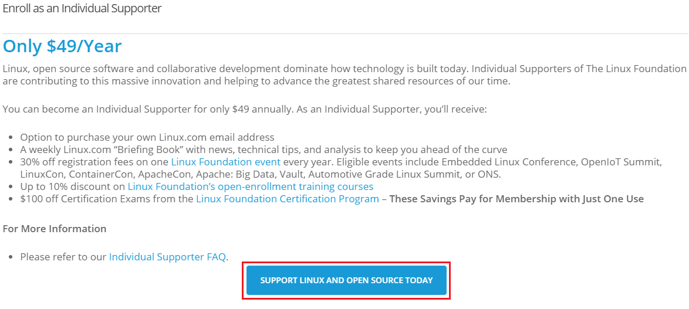
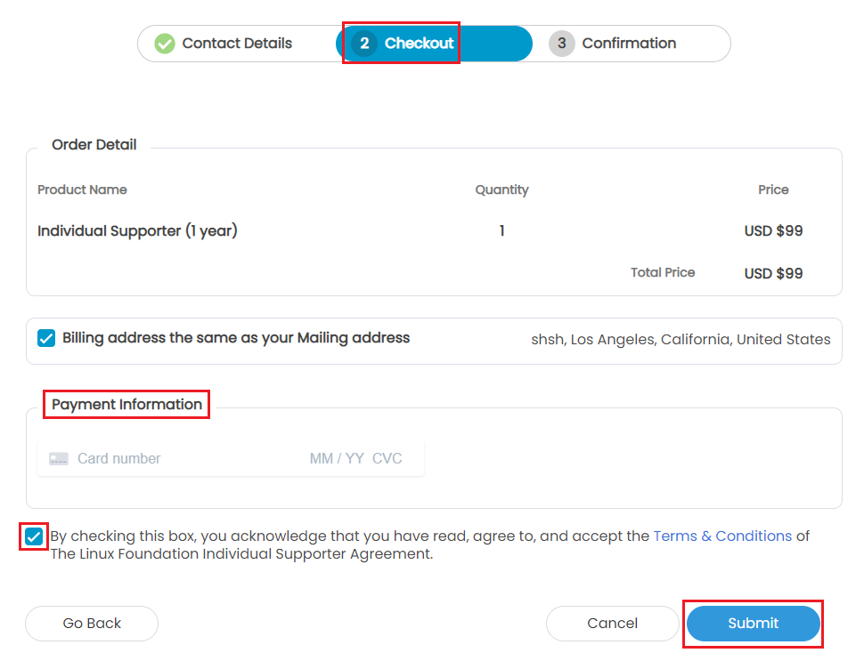
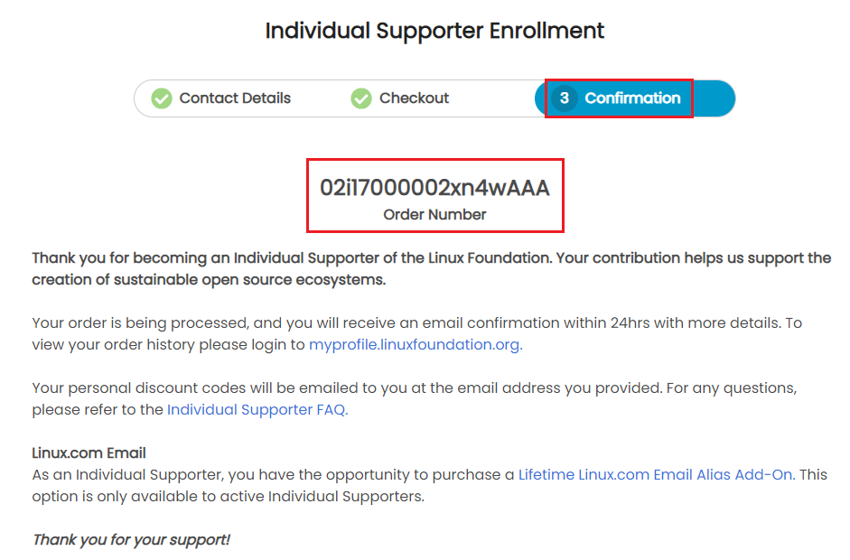

# Purchasing Linux Individual Supporter Program

As an individual, you can purchase Linux Individual Supporter program by purchasing it for $99. You should have a LF account to purchase this program.  

To Purchase a Linux Individual Supporter program, perform the following steps:

1.Click the link [Linux Individual Supporter Program](https://www.linuxfoundation.org/about/individual-supporters/). The Individual Supporter web page appears. 

2.Click the **Individual$99** button from the web page. 

3.The Enroll as an Individual supporter web page appears. Click the **SUPPORT LINUX AND OPEN SOURCE TODAY** button. 

4.The Individual Supporter Enrollment page appears. In the **Contact Details** tab, Enter your **Contact Information**, provide your **Social Accounts**, enter your **Mailing Address** and click **Next**. 

5.The Checkout screen appears. This screen provides you with the **Order Details** and price.  Provide the card details under **Payment Information**, check the Terms and Conditions box and click **Submit**. 

6.The Confirmation screen appears. This screen provides order number, My Profile link, Individual Support FAQ and link to purchase Linux.com email. 

