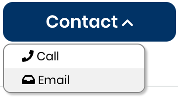

# Contact a Mentee

1. To contact a mentee [Sign in](../../sso/sign-in/) to [Mentorship](https://people.communitybridge.org/), click on **My Account** menu icon, and select **My Projects** from dropdown.

2. Select the project card to navigate to the project detail page and click on the **Current Mentees** tab to view the list of all the mentee applicants. Click a name of a mentee you would like to contact. You will be navigated to the mentee profile page. 

3. Click on **Contact** dropdown to view the following options and select a contact method. 

* When a phone number is available, a Call link is available.
* When an email is available, an Email link is available.  

