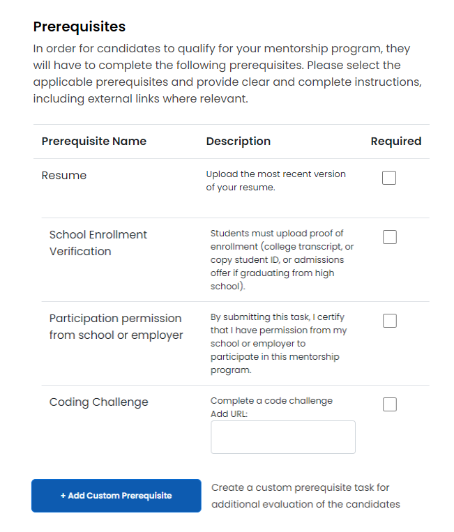

# Mentorship Project Enrollment Form

Below are Mentorship enrollment form fields and their descriptions:&#x20;

| Name                     | Description                                                                                                                                                                                                                                                                                                                       |
| ------------------------ | --------------------------------------------------------------------------------------------------------------------------------------------------------------------------------------------------------------------------------------------------------------------------------------------------------------------------------- |
| **Project  Name **       | A mentorship project name, which must be unique.                                                                                                                                                                                                                                                                                  |
| **Technologies**         | Programming languages and technologies the program will be using.                                                                                                                                                                                                                                                                 |
| **Elevator Pitch**       | A description of the mentorship program.                                                                                                                                                                                                                                                                                          |
| **Repository URL**       | A link to the open-source project repository the mentorship program will be using.                                                                                                                                                                                                                                                |
| **Website URL**          | A link to the website associated with the mentorship program.                                                                                                                                                                                                                                                                     |
| **CII Project ID**       | The [Core Infrastructure Initiative (CII) Badge Program](https://www.coreinfrastructure.org/programs/badge-program/) is an open source secure development maturity model. Project admins need to apply to get a badge and CII Project ID number if their project doesn't have one.                                                |
| **Code of Conduct URL**  | URL for the open source project code of conduct. If a project doesn't have a code of conduct, a program admin can create one by using a provided template. If not code of conduct is provided, the URL will default to [Contributor Covenant](https://www.contributor-covenant.org/version/1/4/code-of-conduct) code of conduct.  |
| **Project Logo**         | An open source project logo. File size should be 2MB max and in JPG, PNG, or SVG format.                                                                                                                                                                                                                                          |
| **Project Accent Color** | A color that's a part of the project's brand.                                                                                                                                                                                                                                                                                     |

### Program Setup Section 

| Name**             **                 | Description                                                                                                                                                                                                                                                                                                                                                                                        |
| ------------------------------------- | -------------------------------------------------------------------------------------------------------------------------------------------------------------------------------------------------------------------------------------------------------------------------------------------------------------------------------------------------------------------------------------------------- |
| **Required and/or desirable skills ** | The desirable skills and training that mentees applying to the program should have.                                                                                                                                                                                                                                                                                                                |
| **Project Mentors**                   | Added mentors will receive an email inviting them to create a profile and join your mentorship program.                                                                                                                                                                                                                                                                                            |
| **Program Terms**                     | 
Terms for your mentorship program. A program can have maximum two terms at the same time. 

<strong>Note: </strong>Program administrators can use any <em>Term</em> name during program creation. For example, Spring 2021, Summer 2021, Fall 2021, and so on.

For Full Time (FT) and Part Time (PT) distinction, please add FT or PT to the name, i.e. Spring 2021- FT

  
 |

### Prerequisites Section 

Program admins can select which prerequisite requirements mentees need to complete in order for their application to be considered for the program. Alternatively, they can create custom prerequisites by specifying names, due dates and whether they requires a file upload.&#x20;

### Terms and Conditions 

The terms and conditions checkbox is mandatory and need to be selected before the form can be submitted.
