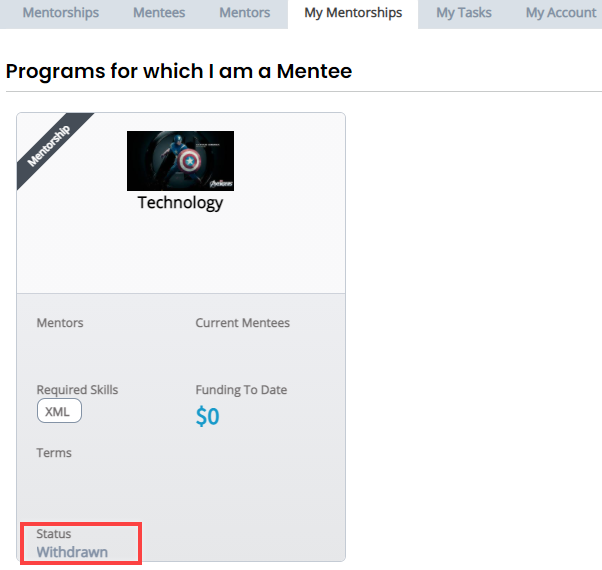

# Withdraw your Application


**Note: **You cannot withdraw your application if it is already accepted.


To withdraw your mentorship application:

1. [Sign in](../../sso/sign-in/) to [Mentorship](https://mentorship.lfx.linuxfoundation.org).
2. Click **My Mentorships **tab.
3. Under **Programs for which I am a Mentee**, navigate to a project from which you want to withdraw your application.
4. Click **Withdraw**, and then** **click** Confirm **on the confirmation window.

5\. Status of your application changes to **Withdrawn**.

