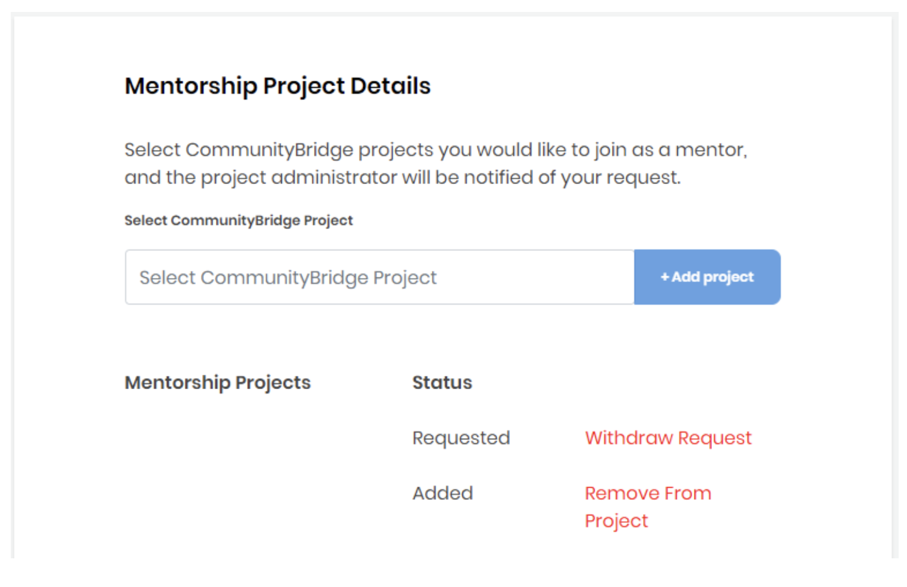

# Admin Invites a Mentor to a Program

Program admin can invite a mentor to volunteer for a mentorship program by adding her as a mentor. When admin ads a mentor, the mentor receives an email notification letting her know that she's been added and asking her to [create a mentor](../../mentees/create-a-mentee-profile.md) profile if she doesn't have one.

If a mentor already has a profile on LFX Mentorship there is no action required, unless she want to remove herself from the program. Below is a screenshot of the email that mentor receives after being added by the program admin.

A mentor can remove herself from a program by navigating to her profile and selecting **Remove from Project** CTA next to the program name she wants to be removed from.

