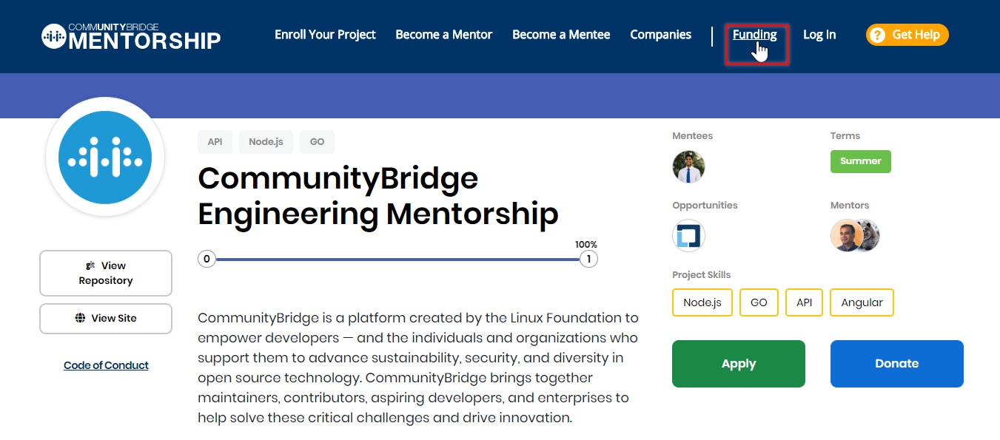
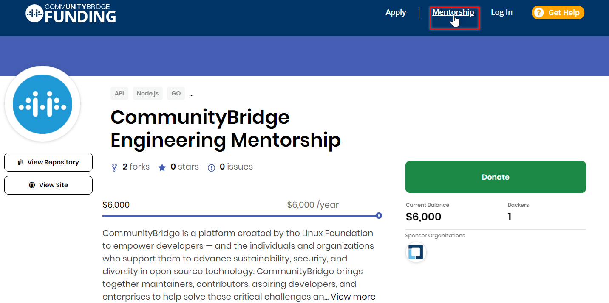

# Toggle Between Mentorship and Funding

Each mentorship card is visible on both Mentorship and Funding for the following reason: 

* **Mentorship Program**  By offering paid mentorships, projects are able to provide mentees with opportunities to learn from experienced open source contributors as a segue to get internship and job opportunities after successful completion of the mentorship program. 
* **Financial Information**   The Funding platform displays the mentorship program's financial information, including the total amount of funds donated to the program and the amount of stipends paid out. 

Users can toggle between Mentorship and Funding to gain an insight into the mentorship program details and the financial records, which are visible on the Funding side. 

**To toggle between Funding and Mentorship:**

1. Select a project you would like to view. 
2. From Mentorship, click on **Funding** in the navigation menu and vice versa.

The project details or project list appears in the service you selected.

