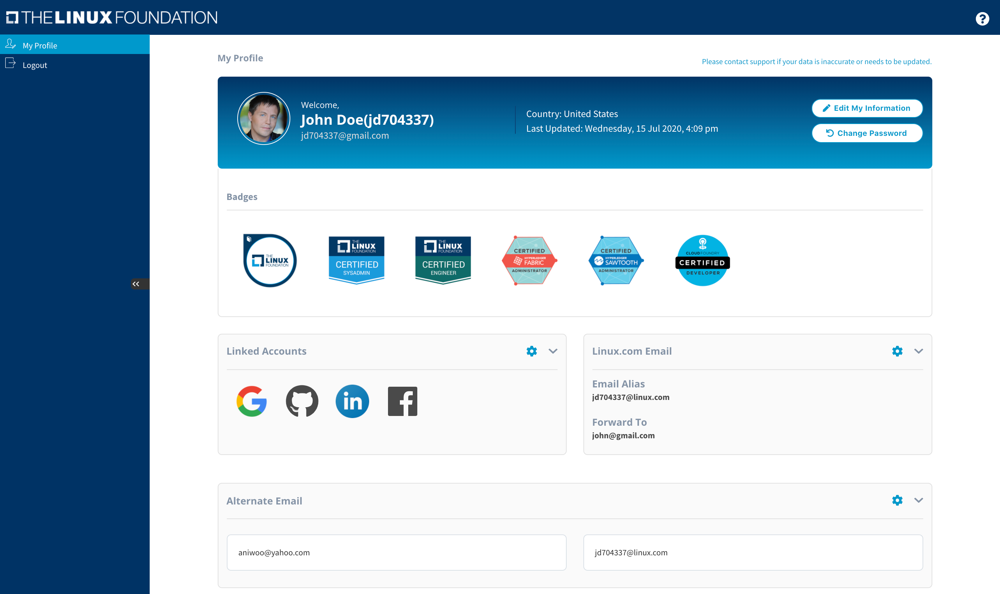
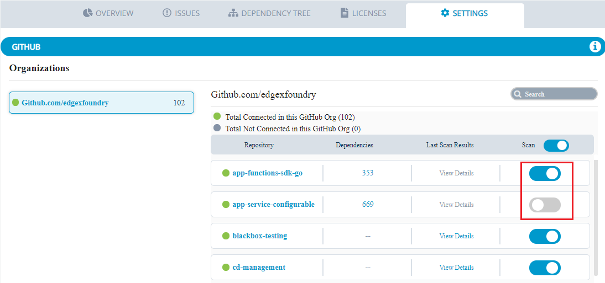
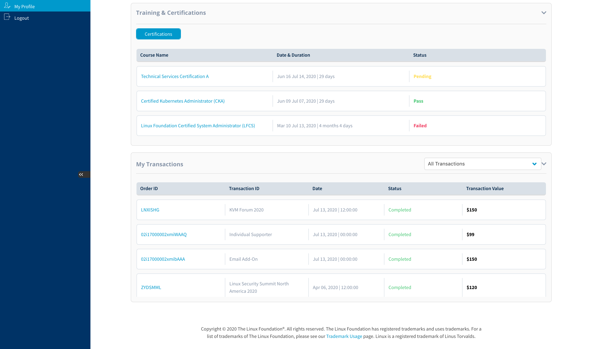

# Individual Dashboard \(MyProfile\)

Individual Dashboard \(MyProfile\) is a self-service dashboard where you can edit your contact information, change your password, keep track of your emails and community identities, and much more. We are providing early access to the Individual Dashboard \(MyProfile\) in order to provide the community with an initial look at their profiles across LF services. We will be continuing to update the dashboard to provide users with greater visibility into—and control over—their personal information.


Information in your profile is subject to the Linux Foundation's [Privacy Policy](https://linuxfoundation.org/privacy)


Select a topic below to view detailed information about that section. 

* [Edit My Information](managing-your-profile.md)
* [Change Password](changing-account-password.md)
* [View Community Badges](viewing-community-badges.md)
* [Link Social Accounts](linking-social-accounts.md)
* [Add Alternative Email Accounts](adding-alternative-emails.md)
* [Purchase Linux.com Email Alias](purchasing-linux-email.md)
* [View Participation in Events](viewing-the-events.md)  
* [View Roles](view-roles.md)
* [View Training and Certifications ](viewing-training-and-certifications.md)
* [View Transactions](viewing-the-transactions.md)

