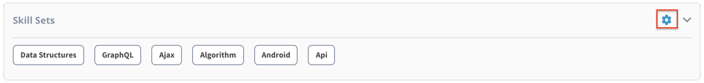

# Add Skill Sets

1. To add your skill sets, login to [myprofile.lfx.linuxfoundation.org](https://myprofile.lfx.linuxfoundation.org/) and click the settings iconon the **Skill Sets** section.

2. On the **Skill Sets** subpage, enter your skill set and select +Add CTA button**,** the added skill will appear in **Skills Added** section below. 

3. Click on **Back to Profile** to return to the dashboard.

