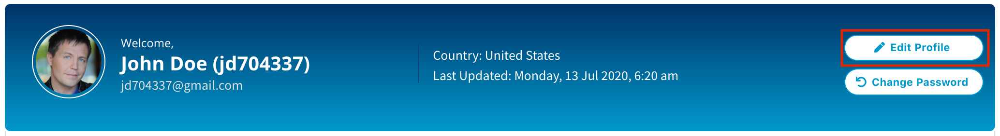
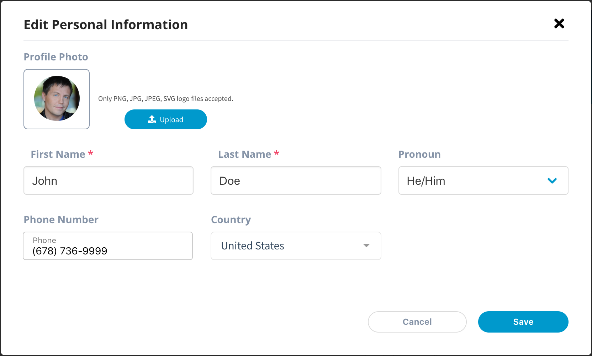

# Manage Your Profile

You can view and edit your Linux Foundation profile by updating your profile picture and personal information, changing your password, adding alternative emails to list just a few self-service options.

To edit your profile, follow these steps:

1. Navigate and login to [myprofile.linuxfoundation.org](https://myprofile.linuxfoundation.org/). When the dashboard appears, click the **Edit Profile** CTA button.

2. On the Edit Personal Information modal you can update the following details:

| **Field** | **Action** |
| :--- | :--- |
| **Profile Photo**  | Click Upload to upload your profile photo |
| **First Name** | Update your first name  |
| **Last Name** | Update your last name |
| **Pronoun** | Select the pronoun from the list |
| **Phone** | Update your phone number |
| **Countries** | Select your country from this list |

3. After making the changes, click **Save**. 

