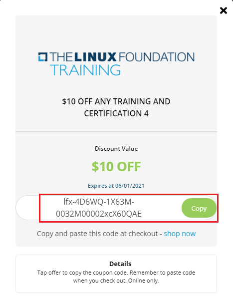

# My Rewards

My Rewards section under My Profile allows you to check the earned coupons which you have gained when you had purchased any trainings, certifications or events from the Linux Foundation. 

My Rewards also allows you to view the transactions related to the purchases you have made through Linux Foundation.

My Rewards consists of the following sections in it:

* My Coupons
* My Transactions 

.png>)

## My Coupons 

My Coupons section provides you with a list of trainings, certifications or events that you are eligible to avail discounts using the coupon codes. You can use these coupon code by redeeming the reward points.  My Coupons sections provides you the details of the trainings, certifications, events, discounts, and the reward points that you can redeem. 

### Earned Coupons

Earned coupons will allow you to claim a discount for the training and certifications. You are eligible for earned coupons if you have registered for any event or purchased any trainings or certifications from the Linux Foundation in the past. 

For example, if you have registered for an event say Cloud Native conference, you will receive a earned coupon for that. 

When you hover over the mouse on the   icon, you can see the details related to the earned coupon.

 (1).png>)

To claim the earned coupon, perform the following steps:

1.Login to [MyProfile](http://myprofile.linuxfoundation.org) using your LFID and click the **My Rewards** CTA link. 

2.Click **My Coupons**. Earned Coupons section appears with the list of trainings and certifications that you are eligible to claim the coupon code. Click **Claim Coupon**.

3.A Pop message appears. Click **Claim Code**. 

4.Copy the discount code and paste this code at checkout on the [Training Portal](https://trainingportal.linuxfoundation.org).

5.The same coupon code can be viewed by click of the **View Coupon Code**. 

.png>)

## My Transactions

To view your transactions for all the purchases you made through Linux Foundation, login to [My Profile ](https://myprofile.lfx.linuxfoundation.org)and scroll down to My Transactions section. In this section you can view the following transaction details: 

* All Transactions 
* Event Tickets 
* Training + Certifications 
* Individual Support and Linux.com Purchase 

.png>)

In this section you can view the following transaction details:  

* Name, which is the name of the product, event, training or certification course
* Order ID number, which is also displayed on the order confirmation email 
* Transaction Date
* Transaction Status, i.e. Completed 
* Transaction Value, that provides the the purchase amount

### All Transactions

All Transactions provides the transaction details related to all the transactions.

### **Event Tickets **

Event Tickets provides the transaction details related to the event. 

### **Training and Certifications **

Training and Certifications provides the transaction details related to training and certifications.  

### **Individual Supporter Program and Linux.com Purchase**

Individual Supporter Program and Linux.com Purchase provides transaction  details related to the individual support program and Linux.com purchases.

 
